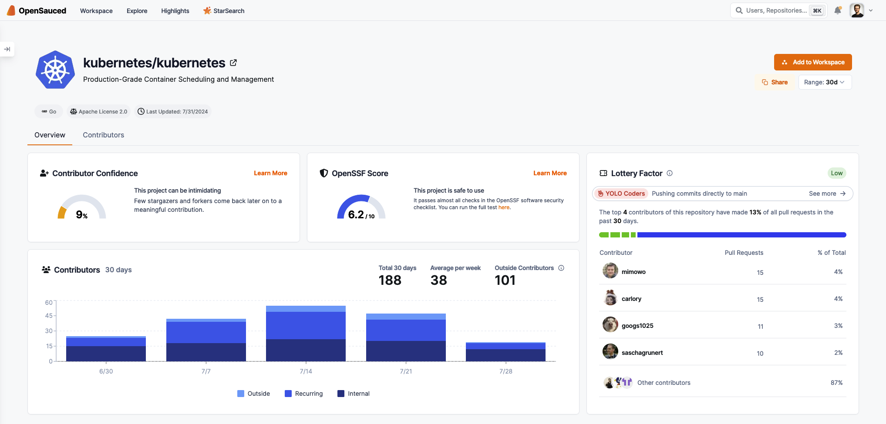

In September of 2022, the European Parliament introduced the [“Cyber Resilience Act”](https://digital-strategy.ec.europa.eu/en/policies/cyber-resilience-act),
commonly called the CRA: a new piece of legislation that requires anyone providing
digital products in the EU to meet certain security and compliance requirements.

<!-- truncate -->

But there’s a catch: before the CRA, companies providing or distributing software
would often need to take on much of the risk when ensuring safe and reliable software
was being shipped to end users. Now, software maintainers further down the supply
chain will have to carry more of that weight. Not only may certain open source
maintainers need to meet certain requirements, but they may have to provide an
up to date security profile of their project.

[As the Linux Foundation puts it](https://www.linuxfoundation.org/blog/understanding-the-cyber-resilience-act):

> The Act shifts much of the security burden onto those who develop software,
as opposed to the users of software. This can be justified by two assumptions:
first, software developers know best how to mitigate vulnerabilities and distribute
patches; and second, it’s easier to mitigate vulnerabilities at the source than
requiring users to do so.

There’s a lot to unpack in the CRA. And it’s still not clear how individual open
source projects, maintainers, foundations, or companies will be directly impacted
But, it’s clear that the broader open source ecosystem needs easier ways to understand
the security risk of projects deep within dependency chains. With all that in mind,
we are very excited to introduce the OpenSSF Scorecard ratings within the OpenSauced
platform. 

## What is the OpenSSF Scorecard?

The OpenSSF is [the Open Source Security Foundation](https://openssf.org/): a multidisciplinary group of
software developers, industry leaders, security professionals, researchers, and
government liaisons. The OpenSSF aims to enable the broader open source ecosystem
“to secure open source software for the greater public good.” They interface with
critical personnel across the software industry to fight for a safer technological
future.

[The OpenSSF Scorecard project](https://github.com/ossf/scorecard) is an effort
to unify what best practices open source maintainers and consumers should use to
judge if their code, practices, and dependencies are safe. Ultimately, the “scorecard”
command line interface gives any the capability to inspect repositories, run “checks”
against those repos, and derive an overall score for the risk profile of that project.
It’s a very powerful software tool that gives you a general picture of where a piece
of software is considered risky. It can also be a great starting point for any open
source maintainer to develop better practices and find out where they may need to
make improvements. By providing a standardized approach to assessing open source
security and compliance, the Scorecard helps organizations more easily identify
supply chain risks and regulatory requirements.

## OpenSauced OpenOSSF Scorecards

Using the scorecard command line interface as a cornerstone, we’ve built infrastructure
and tooling to enable OpenSauced to capture scores for nearly all repositories on
GitHub. Anything over a 6 or a 7 is generally considered safe to use with no blaring
issues. Scores of 9 or 10 are doing phenomenally well. And projects with lower scores
should be inspected closely to understand what’s gone wrong.

Scorecards are enabled across all repositories. With this integration, we aim to
make it easier for software maintainers to understand the security posture of their
project and for software consumers to be assured that their dependencies are safe
to use.

Starting today, you can see the score for any project within individual [Repository Pages](https://opensauced.pizza/docs/features/repo-pages/).
For example, in [kubernetes/kubernetes](https://app.opensauced.pizza/s/kubernetes/kubernetes),
we can see the project is safe for use:

Let’s look at another example: [crossplane/crossplane](https://app.opensauced.pizza/s/crossplane/crossplane).
These maintainers are doing an awesome job of ensuring they are following best
practices for open source security and compliance!!

The checks that the OpenSSF Scorecard looks for involves a wide range of common
open source security practices, both “in code” and with the maintenance of the
project: e.g. checking for code review best practices, if there are “dangerous
workflows” present (like untrusted code being run and checked out during CI/CD runs),
if the project is actively maintained, the use of signed releases, and many more.

## The Future of OpenSSF Scorecards at OpenSauced

We plan to bring the OpenSSF Scorecard to more of the OpenSauced platform, as we
aim to be the definitive place for open source security and compliance for maintainers
and consumers. As part of that, we’ll be bringing more details to the OpenSSF Scorecard
with how individual checks are ranked:

We’ll also be bringing OpenSSF Scorecard to our premium offering, [Workspaces](https://opensauced.pizza/docs/features/workspaces/):

Within a Workspace, you’ll soon be able to get an idea of how each of the projects
you are tracking stack up alongside each other's score for open source security and
compliance. You can use the OpenSSF Score together with all the Workspace insights
and metrics, all in one single dashboard, to get a good idea of what’s happening within
a set of repositories and what their security posture is. In this example, I’m tracking
all the repositories within the bottlerocket-os org on GitHub, a security focused
Linux based operating system: I can see that each of the repositories has a good
rating which gives me greater confidence in the maintenance status and security
posture of this ecosystem. This also enables stakeholders and maintainers of Bottlerocket
to have a birds eye snapshot of the compliance and maintenance status of the 
entire org.

As the CRA and similar regulations push more of the security burden onto developers,
tools like the OpenSSF Scorecard become invaluable. They offer a standardized, accessible
way to assess and improve the security of open source projects, helping maintainers
meet new compliance requirements and giving software consumers confidence in their
choices. 

Looking ahead, we're committed to expanding these capabilities at OpenSauced. By
providing comprehensive security insights, from individual repository scores to
organization-wide overviews in Workspaces, we're working to create a more secure
and transparent open source ecosystem, to enable anyone in the open source community
to better understand their software dependencies, feel empowered to make a meaningful
change if needed, and provide helpful tools to open source maintainers to better
maintain their projects.

Stay saucy!
