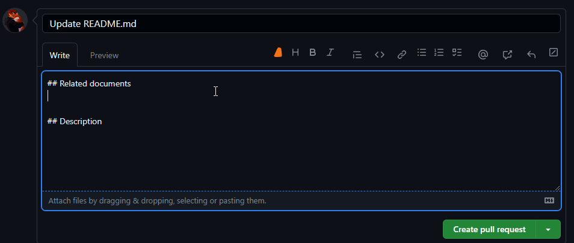

This will help you to create a PR based on the configuration you have in the extension, it will enable you to create the summary based on either **Commit Messages** or **The diff between the files** or **both**, you can even set the length and the tone of the message using the same settings.

_Note: This feature is not available on private repositories._

You can use this settings to set the strictness and the tone of the generated AI, here is an explanation of those settings:

- **Description** length:The output length.
- **Temperature**: Is the similarity between the input text and the output, higher temperature mean more randomness, lower temperature means more strict to the input.
- **Max Input length.**
- **Description language:** right now this feature supports: English, Spanish, French, German, Italian, Portuguese, Dutch, Russian, Chinese, Korean.
- **Description tone:** The tone of the output: Exciting, Persuasive, Informative, Humorous, Formal
- **Description source:** The source of the description that our AI will use to get the output it can be the next:**Commit Messages** or **The diff between the files** or **both**

[Example PR](https://github.com/open-sauced/insights/pull/1197), using the next options: both in the description source, 500 for output length and 3900 max input length, temperature 0.7.

**Exciting:** This PR fixes the follow call and adds a FollowUser function to the contributor-highlight-card. The code has been linted and merged from the beta branch. FollowUser function allows users to follow/unfollow contributors. Copy link and follow/unfollow options are now available in the dropdown menu.

**Persuasive:** This PR fixes the follow call and linting issues in the `ContributorHighlightCard` component. It also merges the `beta` branch into `fix-follow-check`. A new `FollowUser` function has been added to handle follow/unfollow functionality. This PR ensures a smoother user experience.

**Informative:** This PR fixes the follow call and linting issues in the `ContributorHighlightCard` component. A new function `FollowUser` has been added to handle the follow/unfollow functionality. The `useFollowUser` hook has been moved inside this function. The `FollowUser` function is now used in place of the previous follow/unfollow code block. The code has been tested and reviewed.

**Humorous:** This PR fixes the follow call and also lints the file. We've also added a new FollowUser function to make the code more readable. Now you can follow/unfollow contributors with ease. We've also merged the beta branch into fix-follow-check.

**Formal:** This PR fixes the follow call and linting issues in the `ContributorHighlightCard` component. A new function `FollowUser` has been added to handle the follow/unfollow functionality. The `useFollowUser` hook has been moved inside this function. The `FollowUser` function is now used in place of the previous follow/unfollow code block. This PR also merges the `beta` branch into `fix-follow-check`.
