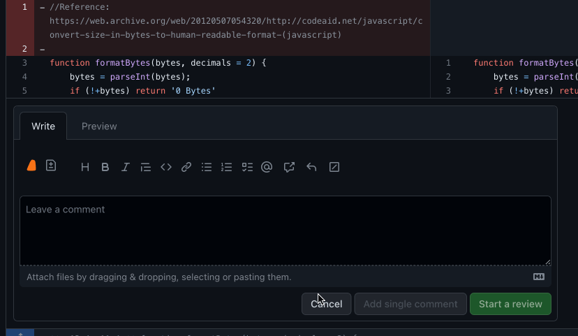

### AI Code Refactoring

Refactor a block of code by using the blue plus button that is displayed when hovering over a line. To select a block of code, hover over the starting line, click and drag the blue plus button until the desired line.

### AI Code Test Generation

Generate tests for a block of code by using the blue plus button that is displayed when hovering over a line. To select a block of code, hover over the starting line, click and drag the blue plus button until the desired line.

