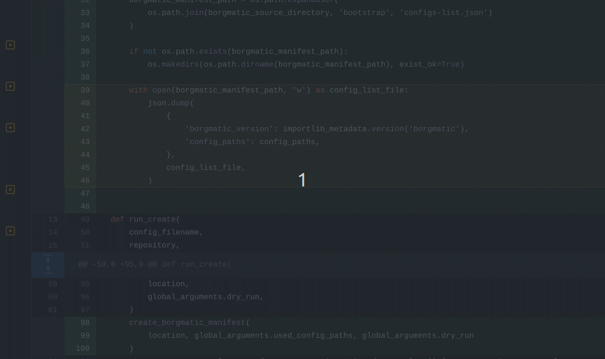
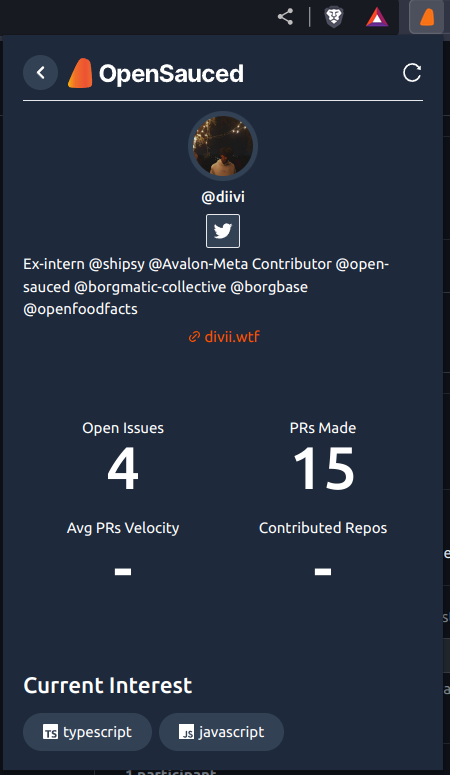

## Using the OpenSauced Chrome Extension

Have you thought about using AI to refactor a code on GitHub or even using it to write the summary of your development?
If you answered both of these questions as a yes, then you are in the right place. OpenSauced extension is a rich features chrome extension,
That's empower developers with AI tools to:

- Using AI to Write a summary of PR.
- Get AI suggestions for code reviews
- Post your work on OpenSauced website
- Get a summary of your repo (PR and Issues stats)
- Get access to OpenSauced links
- Invite a user on OpenSauced
- View a user on OpenSauced

Here are some of the features that make the OpenSauced GitHub Profile Connector so useful:

### Leverage AI generate pull request descriptions

This will help you to create a PR based on the configuration you have in the extension, it will enable you to create the summary based on either **Commit Messages** or **The diff between the files** or **both**, you can even set the length and the tone of the message using the same settings.

_note: This feature is not available on private repositories._

### AI Settings: 

You can use this settings to set the strictness and the tone of the generated AI, here is an explanation of those settings:

- **Description** length:The output length.
- **Temperature**: Is the similarity between the input text and the output, higher temperature mean more randomness, lower temperature means more strict to the input.
- **Max Input length.**
- **Description language:** right now this feature supports: English, Spanish, French, German, Italian, Portuguese, Dutch, Russian, Chinese, Korean.
- **Description tone:** The tone of the output: Exciting, Persuasive, Informative, Humorous, Formal
- **Description source:** The source of the description that our AI will use to get the output it can be the next:**Commit Messages** or **The diff between the files** or **both**

#### Changing configurations: 

#### Example tones:

[Example PR](https://github.com/open-sauced/insights/pull/1197), using the next options: both in the description source, 500 for output length and 3900 max input length, temperature 0.7.

**Exciting:** This PR fixes the follow call and adds a FollowUser function to the contributor-highlight-card. The code has been linted and merged from the beta branch. FollowUser function allows users to follow/unfollow contributors. Copy link and follow/unfollow options are now available in the dropdown menu.

**Persuasive:** This PR fixes the follow call and linting issues in the `ContributorHighlightCard` component. It also merges the `beta` branch into `fix-follow-check`. A new `FollowUser` function has been added to handle follow/unfollow functionality. This PR ensures a smoother user experience.

**Informative:** This PR fixes the follow call and linting issues in the `ContributorHighlightCard` component. A new function `FollowUser` has been added to handle the follow/unfollow functionality. The `useFollowUser` hook has been moved inside this function. The `FollowUser` function is now used in place of the previous follow/unfollow code block. The code has been tested and reviewed.

**Humorous:** This PR fixes the follow call and also lints the file. We've also added a new FollowUser function to make the code more readable. Now you can follow/unfollow contributors with ease. We've also merged the beta branch into fix-follow-check.

**Formal:** This PR fixes the follow call and linting issues in the `ContributorHighlightCard` component. A new function `FollowUser` has been added to handle the follow/unfollow functionality. The `useFollowUser` hook has been moved inside this function. The `FollowUser` function is now used in place of the previous follow/unfollow code block. This PR also merges the `beta` branch into `fix-follow-check`.

## Leverage AI generate for suggested code during pull request reviews

_note: This feature is not available on private repositories._

### View valuable insights about your GitHub profile

### Invite GitHub users to join OpenSauced with a single click

### View GitHub users' OpenSauced profiles and connect with them

### Quick Access to important OpenSauced links

### Posting highlight

You can access the post to highlight it from the popup window in the extension. When you clicked, it will automatically, populate the PR or issue title, here you can use our AI functions to get a summary of the highlight similar to the PR summary. 

#### Successful highlight:

If you post a successful highlight it will show you a message with an option to see the highlight on the OpenSauced website. 

#### Errors example: 

If you presented with an error with the summarization it will be printed in the text area, this is an example of it: 

