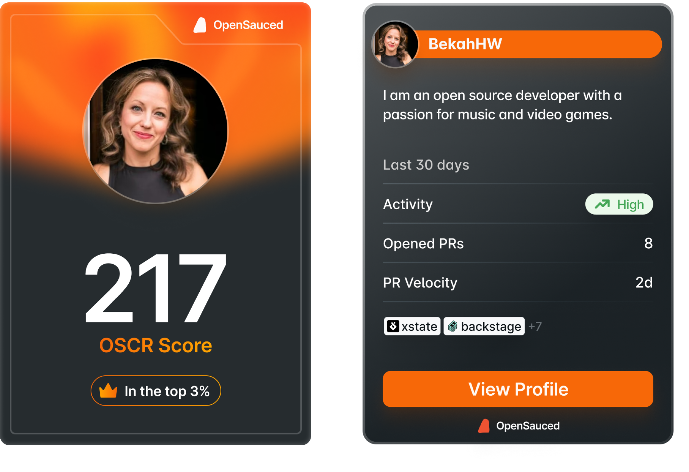

Inspired by the great work of the [#100DaysOfCode challenge](https://www.100daysofcode.com/), we're starting #100DaysOfOSS.

With this challenge, OpenSauced hopes to help contributors enhance their skills, expand their abilities, gain practical experience over 100 days, support maintainers, onboard more contributors into open source, and expand the open source community. With a focus on open source software (OSS), we encourage contributors of all technical backgrounds to immerse themselves in the world of collaborative development and engage with a supportive community.

## How to Participate

The beauty of this challenge is that you're not required to code. The main purpose is to grow in your understanding of open source software (OSS), contribute in ways that are meaningful to you, and further develop the skills and knowledge you're interested in pursuing. It's all about personal growth and making a positive impact on the OSS community. Because this challenge is focused on growth, you can participate in any way that helps you achieve your goals, including taking days off when you need it.

There are numerous ways to participate in the #100DaysOfOSS challenge, including:

### Content Creation

Love creating content? Here's how you can use this skill for the challenge:

- Give a talk or presentation on OSS.
- Participate in or even start an X Space.
- Write a blog post or create a video about OSS.

### Project Management

Want to improve your project management skills? Need to get better at communicating or giving feedback to others? Here's how you can use this skill for the challenge:

- Review pull requests.
- Triage issues.
- Start meaningful discussions.
- Write issues to identify bugs or suggest new features.

### Community Engagement and Leadership

Community experience is involved in many different tech jobs, including support, success, Developer Relations, Developer Experience, and more. Community experience can be a valuable skill to develop. Some ways you can do this:

- Engage in the community by sharing your insights and knowledge.
- Support contributors working on OSS projects, providing guidance and support.
- Create a study group or accountability group where you work on your goals.

### Technical Skills

Now is a great time to show your technical growth. Here are some paths you can take:

- Update or write documentation to improve clarity and usability.
- Maintain a project: review pull requests, triage issues, and respond to questions.
- Submit pull requests to contribute code changes.

### Tracking Your Progress

To keep track of your progress, post on social media, your blog, or any other platform you prefer with:

- progress you made,
- the day of the challenge indicated by 'D',
- the hashtag #100DaysOfOSS.

For example, if you're on day one, you could say, "Today, I reviewed the documentation for the [OpenSauced/App](https://github.com/open-sauced/app) repository. D1 #100daysOfOSS." Then, on day two, you would continue with D2, and so on.

Here's what you can do if you're ready to join this challenge:

- [Post your commitment today on X](https://twitter.com/intent/tweet?text=I%27m%20joining%20the%20%23100DaysOfOSS%20challenge%20with%20%40saucedopen%20to%20grow%20my%20skills%2C%20gain%20real-world%20experience%20in%20open%20source%2C%20and%20to%20make%20a%20positive%20impact%20on%20the%20OSS%20Community!) or share on your platform of choice!

Your OpenSauced Profile, includes your DevCard, which is a great way to track your progress. Remember, it's not about what the number is today; it's about what the number is at the end of 100 days. Check out [Numbers and Narratives: The Dual Power of Tracking Your Open Source Journey](https://opensauced.pizza/blog/numbers-and-narratives) for more information on effectively tracking your progress and telling your story.

#### How to check your OSCR

Go to your OpenSauced Profile. For example, https://app.opensauced.pizza/u/bekahhw. You can also check out [this contributor insight page](https://app.opensauced.pizza/workspaces/cff3f17b-f052-4686-85af-72971009136b/contributor-insights/545c756a-39e0-4361-b516-9610cb413959/overview) to see the members of our 2024 cohort. 

Remember, there's value in knowing the story behind the numbers. When you share your DevCard, tell the story behind your number. 

## The Official Kickoff

 The #100DaysOfOSS challenge is flexible; you can join whenever you're ready. Just jump in at any point and begin with day one of your personal challenge.

## Support

To make the most of your #100DaysOfOSS journey, here are some additional resources and events you can explore:

1. **Weekly Events:** Join our events, where we discuss open source topics, share insights, and connect with like-minded individuals. Follow us on [X](https://twitter.com/saucedopen) to stay updated on upcoming sessions.
2. **Learning Resources:** Check out our [Learning Resources](https://opensauced.pizza/learn/#/) to find courses, tutorials, and other educational materials to help you grow your skills.
3. **Discussion Forum:** Have questions or need help? Join us in our [Community](https://github.com/orgs/open-sauced/discussions/1) or post on our [#100DaysOfOSS discussion](https://github.com/orgs/open-sauced/discussions/36). We're here to help you succeed!

## Where to Start?

If you're ready to start your #100DaysOfOSS journey, here are some tips to help you get started:

- **Find a project:** Explore the [OpenSauced](https://opensauced.pizza/) website to find a project that interests you. 
- **Take our Intro To Open Source course:** If you're new to open source, we recommend taking our [Intro to Open Source course](https://opensauced.pizza/learn/#/) to learn more about open source and how to get started.
- **Record your journey:** You will learn a lot as you navigate this challenge, so we highly recommend using our [#100DaysOfOSS journal template](https://github.com/open-sauced/100-days-of-oss-template) on GitHub or [Notion](https://www.notion.so/a0m0rajab/100-Days-Of-Open-Source-2615e66772e14152897002e348c5f1bc?pvs=13) to help you reflect. Remember, this is _your_ journey, so feel free to customize them however you like.
- **Check our Contributors Guide:** If you're new to contributing to open source, we recommend checking out our [Contributors Guide to OpenSauced](https://opensauced.pizza/docs/contributors/contributors-guide-to-open-sauced/) to learn more about the process and best practices.

### Find Projects You're Interested in 🔍

In the Intro to Open Source course, we talk about how to find projects to contribute to. When you contribute, start by understanding the project. Here are some steps you can take:

- Read through the ReadMe of the projects
- Find the contributing.md files and read through those
- Take a look at a Bug Report and Feature Request Issue on each of the repositories. Familiarize yourself with the format and information provided.  
- Notice how well clear communication helps to aid the process.

Here's [a post](https://opensauced.pizza/docs/community-resources/how-to-write-a-good-issue-tips-for-effective-communication-in-open-source/) you can read on writing good issues.

## The Power of the #100DaysOfOSS Challenge

The #100DaysOfOSS challenge offers a supportive community where developers can find encouragement, share experiences, and overcome roadblocks together.

Our hope is that the community will provide a safe space to discuss challenges, celebrate achievements, and exchange insights, creating an environment that helps individuals stay on track and avoid giving up.

## Why Join the #100DaysOfOSS Challenge?

1. **Skill enhancement**: By working on real-world projects, you'll gain practical experience and exposure to different projects, documentation, communities, programming languages, frameworks, and tools. You'll also learn from experienced developers, receive feedback on your code, and improve your problem-solving abilities.

2. **Collaboration and networking**: You'll have the opportunity to work alongside other contributors, collaborate on shared goals, and build professional relationships. This experience can lead to networking opportunities, mentorship, and exposure to diverse perspectives in tech.

3. **Resume and portfolio boost**: Experience in open source demonstrates your ability to work in a team, follow best practices, and contribute to larger codebases. Open source contributions are tangible evidence of your skills, commitment, and ability to grow.

4. **Learning from peers**: By examining the codebase, participating in discussions, engaging in the community, and reviewing pull requests, contributors can gain insights into different approaches to community, projects, coding styles, architecture patterns, and software development best practices, accelerating a developer's learning curve.

5. **Making a positive impact**: Your contributions benefit other contributors who rely on these projects, fostering a sense of fulfillment and giving back to the community.

Happy contributing, and best of luck on your #100DaysOfOSS adventure!
