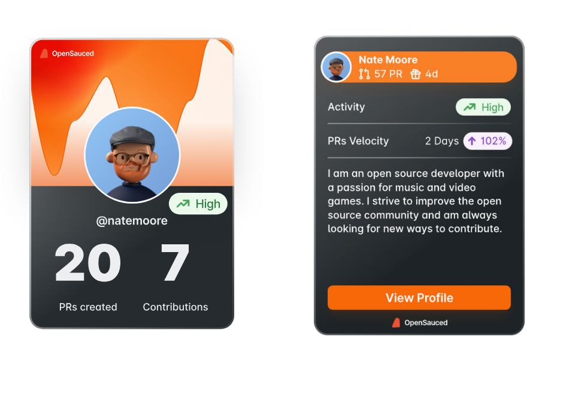

The Dev card feature is what we like to call your "open source business card." On the front, you see your username, the number of pull requests you have created, repositories you contribute to, a `View Profile` button that takes you to your dashboard, and a green icon, which describes your activity rate. When you click on the back of your card, you see additional information, including your OpenSauced profile's headline, the date of your first contribution on GitHub, and your [PR velocity rate](../../docs/community/pr-velocity.md).

Whether you are a person who's just beginning their open source journey or a maintainer looking for more contributors and/or sponsors, the Dev Card is a shareable snapshot of your contributions, skills, and engagement in the open source community.

Eager to get your Dev Card? Create it today and share with your network!
