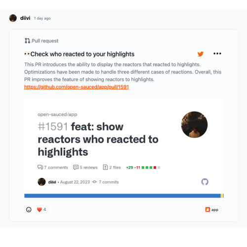

The Highlights feature is what we like to call the "glitzy pepperoni" of your OpenSauced profile. It's the place where you can display your favorite open source contributions, share the story, and inspire others to join you in your open source journey. For maintainers, it's a great way to showcase your project, the issues that need support, and attract new contributors.

There are currently three types of highlights you can add to your profile: 
1. a Dev.to blog post
2. a Pull request
3. a issue

For more examples of highlights, got to the [OpenSauced Insights feed](https://insights.opensauced.pizza/feed).

Eager to get started? Check out the [Effectively Highlight Your Contribution section](https://github.com/open-sauced/intro/blob/main/06-the-secret-sauce.md#effectively-highlight-your-contributions) in our free "Intro to Open Source" course to learn more.
