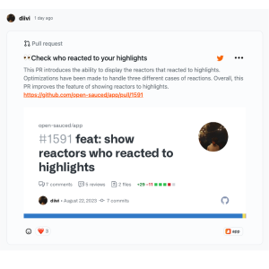

The Highlights feature is what we like to call the "glitzy pepperoni" of your OpenSauced profile. It's the place where you can display your favorite open source contributions. There are currently three types of highlights you can add to your profile: a Dev.to blog post, a pull request, or an issue.

For more examples of highlights, got to the [OpenSauced Insights feed](https://insights.opensauced.pizza/feed).

Eager to get started? Check out [the Effectively Highlight section in our free "Intro to Open Source" course](https://github.com/open-sauced/intro/blob/main/06-the-secret-sauce.md#effectively-highlight-your-contributions) to learn more.
