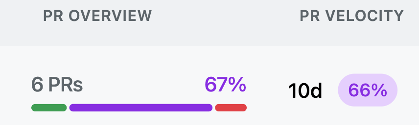

The PR Velocity as shown in purple in the screenshot below, measures the percentage and amount of days that  pull requests that are merged. It's a great way to track the progress of your open source contributions.

