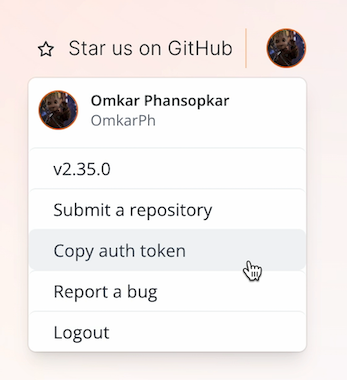

You need to obtain an authentication token to interact with the OpenSauced public API as an authenticated user.

The following steps outline how to obtain an authentication token from the [hot.opensauced.pizza](https://hot.opensauced.pizza) website:

1. Click on your avatar in the top right corner of the page. This will open a dropdown menu.

   

2. Click on the "Copy auth token" option to copy your auth token to clipboard.

   

3. You can now use this token to make authenticated requests to the OpenSauced public API by including it in the Authorization header of your requests. For example:

   ```javascript
   const response = await fetch(
     "https://api.opensauced.pizza/v2/auth/session",
     {
       method: "GET",
       headers: {
         Authorization: `Bearer ${token}`,
       },
     }
   );
   ```
