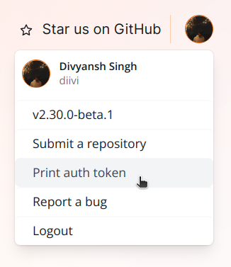
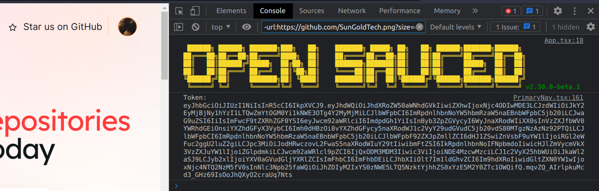

To interact with the OpenSauced public API as an authenticated user, you need to obtain an authentication token.
The following steps outline how to obtain an authentication token from the [hot.opensauced.pizza](https://hot.opensauced.pizza) website:

1. Click on your avatar in the top right corner of the page. This will open a dropdown menu.

   

2. Click on the **Print Auth Token** option. Don't worry, this is a safe operation. The token is only printed to the console.

   

3. Copy the token that is printed to the console.

   

4. You can now use this token to make authenticated requests to the OpenSauced public API by including it in the Authorization header of your requests. For example:

   ```javascript
   const response = await fetch("https://api.opensauced.pizza/v1/auth/session", {
     method: "GET",
     headers: {
       Authorization: `Bearer ${token}`,
     },
   });
   ```
