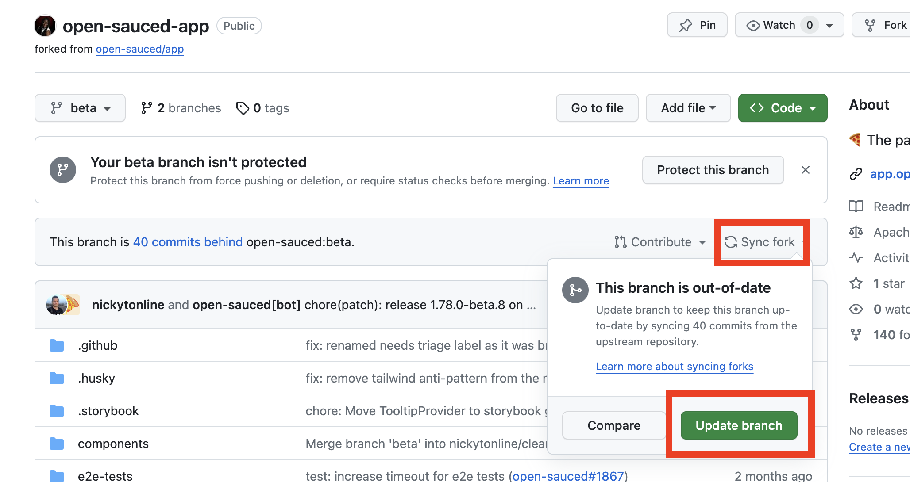
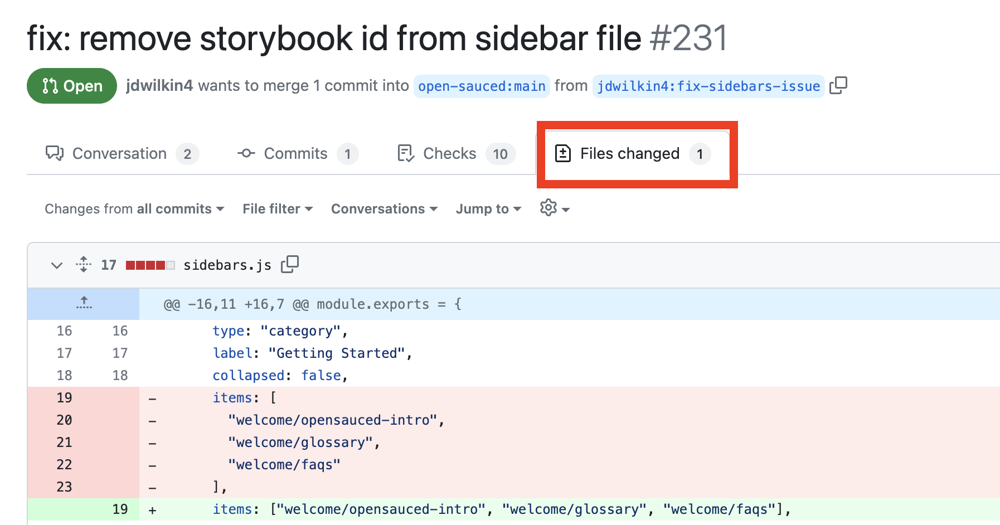

When you are working on any of the OpenSauced repositories, you might run into a merge conflict. A merge conflict occurs when multiple conflicting changes are made to the same line in a file. Merge conflicts happen the most when you open a pull request, as the release process generally updates `npm-shrinkwrap.json`.

In this guide, we will talk about how to resolve merge conflicts and how to keep your branch up to date.

## How to Check for Merge Conflicts Locally

If you are actively working on a change to an OpenSauced repository, you can check for potential merge conflicts by running a few commands in the terminal.

1. Make sure you are on the correct branch where the changes are being made

```bash
cd app
git checkout <your-branch>
```

2. Fetch the latest changes from the OpenSauced main repository.

```bash
git fetch upstream
```

3. See the differences between your branch and the OpenSauced main branch

```bash
git diff <your-branch> upstream/main
```

**NOTE**: Some of the OpenSauced repositories will use `main` for the main branch while others like the [app repository](https://github.com/open-sauced/app), will use `beta` for the main branch name.


**NOTE**: If you have already opened up a pull request, then you can see if there is a conflict at the bottom of the PR. Even though it is possible to resolve conflicts through GitHub, it is best practice to resolve them locally.


## How to Resolve Merge Conflicts

If you have merge conflicts, it is best to use a text editor to resolve them. Identify the conflicting files and open them up in your editor of choice. For the conflicting sections, you have an option to either keep the incoming changes, keep your changes or keep both sets of changes. The conflicting sections will be marked with `<<<<<<<`, `=======`, and `>>>>>>>` symbols.

Here is a [guide](https://dev.to/adiatiayu/how-to-resolve-merge-conflicts-using-the-merge-editor-feature-on-vs-code-pic) for an in depth walkthrough of the process. Once you have resolved all of the conflicts, then you can stage, commit and push your changes to your branch.

```bash
git status
git add .
git commit -m "fix: resolving merge conflicts"
git push
```

## How to Keep Your Branch Updated

It is common for your branch to fall behind the main repository's branch. So it is important to keep it up to date as you are contributing.

### Using GitHub

To update your branch on GitHub, you can go to your forked copy of the project and click on `Sync fork` and then the `Update branch` button.



### Using Git

To update your branch using Git and the terminal, you can use the following command:

```bash
git pull upstream <main-branch-name>
```

**NOTE**: Some of the OpenSauced repositories will use `main` for the main branch while others like the [app repository](https://github.com/open-sauced/app), will use `beta` for the main branch name.

## Reviewing Your Pull Request

Once you have pushed up your changes, you can review them in your pull request. Under the files changed tab, you will see all of the recent changes including all conflicts resolved.



## Dependency Updates

When dealing with dependency and lock file updates, there are multiple use cases to consider; however, as a baseline, the OpenSauced triage team will not prioritize parallel main features as seen in the roadmap.

However when that happens, it is advised to:

- fast-forward `npm-shrinkwrap.json`
- fast-forward deleted and modified `upstream/beta` changes to `package.json`
- fast-forward your added lines to `package.json`
- run `npm ci` to delete local modules and create dependency resolution from `upstream/beta`

Visual diffing is advised; however, not following the git commit history procedure will result in a rogue pull request that creeps into dependency updates.

Generally speaking, just adding things to a lock file will not be troublesome, and since this is a licensed project, we should be careful when adding dependencies.
