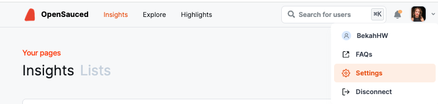
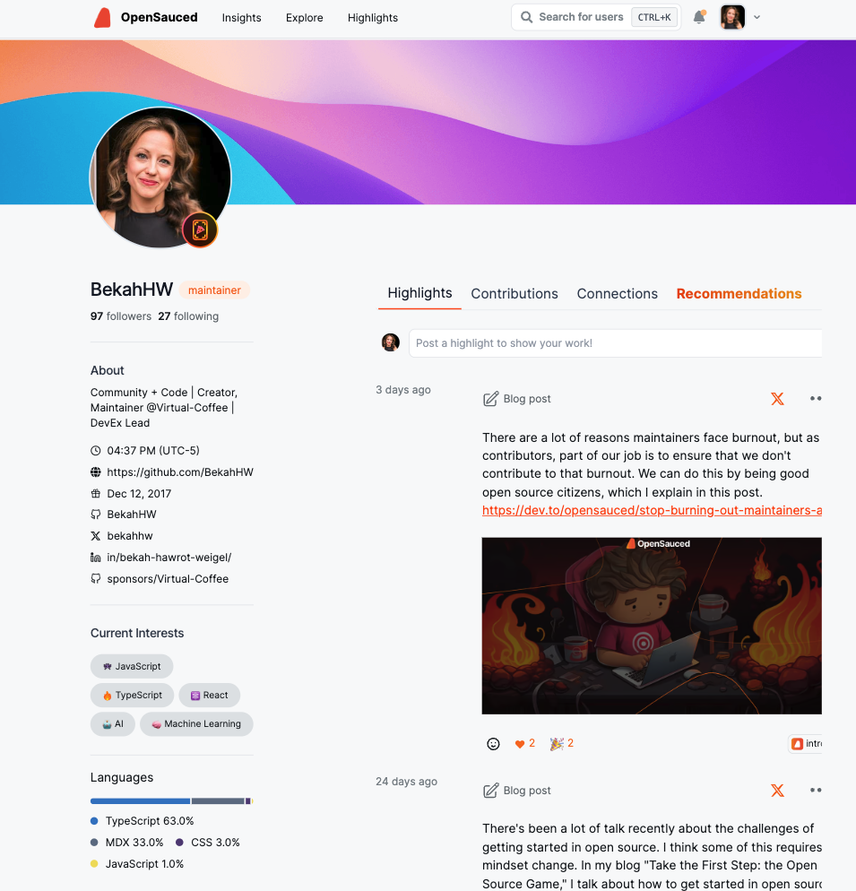

## Introduction to OpenSauced for Contributors

OpenSauced is a platform dedicated to empowering you, the contributor, in your open source journey. With OpenSauced, you can find repositories to contribute to, track your contributions, gain insights into your favorite open source projects, and find new contributors to connect with.

## Getting Started

To get started, you will need to create an account on OpenSauced. You can do this by visiting the [app.opensauced.pizza](https://app.opensauced.pizza) and clicking the "Connect with GitHub" button. You will be prompted to sign in with your GitHub account. Once you have signed in, you will be redirected to the OpenSauced dashboard. The best place to get started is by creating your profile.

## Creating Your Profile

Creating your profile is a great way to showcase your open source contributions, connect with other contributors and maintainers, and share during a job search. Here are some steps to help you get started:

1. After creating your account, navigate to "Settings."

   

2. Once there, you will be asked to add your name, bio, links to your social media accounts, timezone, and other forms of contact information.

   :::tip

   Don't forget to add your personal site, GitHub Sponsors URL, and LinkedIn so people can connect with you and learn more about your work.

   :::

3. In the "Interests" section, select the various programming languages and topics you are interested in. Setting them helps us recommend open source projects that fit your interests.
4. Manage your email preferences.

### Your Profile

Your profile is a great resource for showcasing your contributions and sharing your open source work with others.

On your profile, you will see the "Highlights" tab, which you can learn more about [in this section](#highlights-connecting-and-recognizing-contributions), and three other tabs:

- **Contributions**: This tab includes a graph showing the number of PRs you have opened, [the velocity of your PRs](../welcome/glossary.md#pr-velocity), and the number of repositories you have contributed to. Underneath the graph is a "Latest PRs" chart, which shows a list of current and recent PRs. This tab is helpful if you want to showcase a steady and consistent open source contribution experience.
- **Connections**: For pro accounts, you can reach out to other contributors and maintainers to collaborate on projects or to learn from them.
- **Recommendations**: This tab includes a list of open source projects that are chosen based on the programming languages you picked in the "Interests" section of your public profile. It is useful if you're looking for new projects to contribute to.

## Explore: Finding Your Next Open Source Project

The "Explore" tab is a great place to start if you're looking for a new open source project to contribute to or want to find repositories for potential job opportunities. Here, you can find a list of open source projects and filter them by language, top repos, recent, most active, and more.

Once you've selected your filters, you'll be able to see the contributors, spam, and activity levels of the repository. Understanding a repository's activity level and PR velocity can help you determine if it's a good fit for you to contribute to and what to expect when you submit a PR.

For example, if you wanted to look for a JavaScript project to contribute to, you would select "JavaScript" from the language dropdown and "Most Active" from the filter dropdown to see the most active JavaScript projects on GitHub. If you want to keep track of the repositories you're interested in contributing to, you can select and add them to your [Repository Insights Page](../features/repo-insights.md).

## Highlights: Connecting and Recognizing Contributions

Leveraging OpenSauced's [Highlights](../features/highlights.md) feature is a great way for you to showcase your valuable contributions to open source projects. You can curate and share your achievements and milestones and bring visibility to your hard work.

The Highlights feature allows you to:

- talk about issues that you raised,
- share blog posts that you've written,
- display PRs that showcase your contributions.

### Creating a New Highlight

There are two ways to create a new highlight:

1. Paste the URL to your PR, issue, or blog post (shown in blue below).
2. Choose from a list of suggestions (shown in orange below).

:::note

If you're adding a blog post, you'll need to associate it to a repository by clicking the "Add a repo" button.

:::

Finally, it's time to add the details of your highlight. You can write the description yourself or use the auto-summarize button to generate one.

### Writing an Effective Highlight

Sharing the story of your hard work is an opportunity to connect with the reader, which could include potential collaborators or recruiters. Here are some tips to help you write effective stories for your highlights:

#### Highlighting Issues

1. **Share your motivation**: Briefly explain why you raised the issue. For example, "I'm passionate about improving accessibility because I believe everyone should have equal access to information."
2. **Summarize the issue**: Briefly describe the issue you wrote so your readers have context. For example, "I raised an issue to add alt text to images in the project's 'About Us' page."
3. **Describe the impact:** Briefly state how the resolution of the issue will improve the project. For example, "This will help people who use screen readers to understand the content of the images."

#### Highlighting PRs

1. **Describe the PR**: Start with a clear summary of what your PR accomplishes. For example, "I added a new feature to the project's Chrome Extension that allows users to summarize content."
2. **Highlight your solution and its impact**: Briefly describe the solution, any challenges you faced, or any part of the PR you're particularly proud of. For example, "Initially, I faced challenges with the API, but I was able to resolve them using a different endpoint."
3. **Reflect on your experience**: Mention what you learned from working on the PR. For example, "I learned a lot about the Chrome Extension API and how to use it to create new features."

#### Highlighting Blog Posts

1. **Describe the topic**: Begin with an interesting blog post summary to help your peers and potential recruiters understand your writing.
2. **Discuss the inspiration**: Explain why you wrote this blog post. Is it to guide others on improving their coding skills, raise awareness about an issue in the tech community, or display your progress in learning a new programming language?
3. **End with a call-to-action**: Encourage readers to read and engage with the post.

## Repository Insights: Connecting Your Repositories

OpenSauced [Repository Insights](../features/repo-insights.md) allows you to track open source projects you are interested in. You can use Repository Insights Pages to track repositories' growth, analyze work, and connect with others.

### Why Create a Repository Insights Page

- **To track projects you're working on**: Tracking projects you're working on can help you stay up-to-date with the latest activity, trends, and connect with other contributors.
- **To identify potential projects to contribute to**: If you're looking for a new project to contribute to, you can use the Repository Insights feature to track active projects that are looking for contributors. You can use the "Explore" tab to find new projects to contribute to and track them with your Repository Insights page.
- **To network and engage with the community**: Finding people to work and connect with can be challenging. You can connect with your network through the feature's "Contributors" tab.
- **To track the activity of a topic you're interested in**: Keeping up with the latest trends and activity in a particular topic can be challenging. You can use the Repository Insights feature to track the activity of a specific topic and find new projects to contribute to. For example, you can create a [Repository Insight Page for Active AI Repositories](https://app.opensauced.pizza/pages/BekahHW/1055/dashboard).
- **To track the activity of your favorite programming languages**: If you're interested in tracking the activity of your favorite programming languages, you can use the Repository Insights feature to track the open source projects that are using them.
- **To aid in the job search**: If you're looking for a job, you can use the Repository Insights feature to track the activity of the organizations you're interested in working on. This can help you understand the activity level of the repositories and the types of contributions being made, and even identify which company you want to contribute to.
- **Curating collections for interest groups**: You can curate and share repositories focusing on sectors and programming languages that interest you.

### Creating a New Repository Insight Page

To track the repositories, click the "+" next to "Insights" in the sidebar, then select "New Repository Insight." You will be redirected to a page where you can create your new Repository Insight Page.

There are two ways to add repositories to your Repository Insight Page:

1. **Sync GitHub organization**: Syncing your GitHub organizations is a good idea if you want to keep track of their open source project activities and trends.
2. **Connect individual repositories**: Connecting individual repositories is a good idea if you want to keep track of the contributions of a specific repository or group of repositories.

### Using Your Repository Insights Page

Once you have connected your repositories, you will be redirected to your Repository Insight Page. Here, you will see a dashboard with an overview of the repositories and the contributors who have contributed to them.

There are three tabs that provide you with more information on these repositories:

#### Repositories Dashboard

If you're looking for an active project to contribute to, this tab can help you as it contains information such as activity levels, PR overview, PR velocity, spam PRs, contributors, and activity stats over the last 30 days. This information is also a good way to connect with others on the project or where to find support.

#### Contributors

The "Contributors" tab allows you to view more detailed information about other contributors, including activity levels, the number of repositories they contributed to, the date of their last contribution, their most used language, their time zone, the number of contributions, and their activity stats over the last 30 days. This can be a great way to find others to collaborate with or recommend for jobs.

:::tip

Want to learn more about your peers? You can select and add them to a Contributor Insight Page.

:::

:::note

To learn and understand more about the data provided, see [Understanding Repository Insights Data](../maintainers/understanding-repo-insights.md).

:::

#### Activity

The "Activity" tab shows a graph of the last time each contributor created their PR and how many lines of code they've touched. It also provides more detailed information on each contributor when you hover over their image, including their latest PRs and repositories they've contributed to. Clicking their image will bring you to their profile on OpenSauced.

This information can help you find potential repositories to contribute to and peers to collaborate with or ask for mentorship.

## Contributor Insights: Connecting with Contributors

The [Contributor Insights](../features/contributor-insights.md) feature helps you connect with other contributors or learn more about what others are up to in open source. With this feature, you can categorize, watch, and check out different groups of contributors within open source projects.

### What You can do with Contributor Insights?

There are many things you can do with this feature, but here are some ideas to get you started:

- **Track personal contributions**: If you create a list of your personal contributions, you can track them and see how you're doing over time, as well as get a breakdown of the type of contributions you're making, including commits, created PRs, reviewed PRs, and created issues.
- **Learn about what other contributors are doing in open source**: You can learn where other contributors are contributing, what they're working on, and how active they are in the open source community.
- **See who's using the OpenSauced Highlights feature**: You can see who's using the Highlights feature and show them support by giving an emoji reaction.
- **Track contributors for job opportunities**: If you're looking for a job, you can track the activity of the contributors you're interested in working with. This helps you understand the activity level of the repositories and the types of contributions being made, and you can even identify which company you want to contribute to.

### Creating a New Contributor Insights Page

1. Click the "+" next to "Insights" in your sidebar.
2. Select "New Contributor Insight" to start a new Contributor Insight Page.
3. Give your page a name.
4. Add contributors to your page by searching for their GitHub username, syncing your GitHub Team, or importing your GitHub Following.
5. Once your page is created, you can edit and choose to make it public or private. By default, it is set to public. To create a private page, you can upgrade your account to a paid plan.

## Using Your Contributor Insights Page

Once you have created your list, you will be redirected to your Contributor Insights Page. Here, you will see a dashboard with an overview of the contributors.

There are three tabs that provide you with more information on these repositories:

### Overview

The "Overview" tab gives you a high-level view of the contributors in your list, including the total number of commits in the last 30 days and the types of contributors: [Active](../welcome/glossary.md#active-contributors), [New](../welcome/glossary.md#new-contributors), and [Alumni](../welcome/glossary.md#alumni-contributors).

### Activity

The "Activity" tab gives you a graph view with more detailed information on each contributor, including the type of activity, repositories they've contributed to, and how they compare to each other.

You can filter your Contributor Insight Page by All Contributors, Active Contributors, New Contributors, and Alumni Contributors.

### Highlights

The "Highlights" tab gives you a list of the highlights that the contributors listed on your page have created. This is a great way to see what other contributors are up to and to show them support.

:::note

To learn and understand more about the data provided, see [Understanding Contributor Insights Data](../maintainers/understanding-contrib-insights.md).

:::

## Takeaways

- **Create Your Profile**: Creating your profile is a great way to display your open source contributions, connect with other contributors and maintainers, and share during a job search.
- **Explore**: The "Explore" tab is a great place to find new open source projects to contribute to.
- **Highlights**: Leveraging OpenSauced's Highlights feature is a great way for you to showcase your valuable contributions to open source projects.
- **Repository Insights**: OpenSauced Repository Insights feature allows you to track open source projects you are interested in.
- **Contributor Insights**: The Contributor Insights feature helps you understand other contributors or track your own work in open source.

## Conclusion

We hope this guide has helped you get started with OpenSauced and that you're excited to use the platform to connect with other contributors and maintainers, track your contributions, and find new open source projects to contribute to. If you have any questions or need help, please don't hesitate to reach out to us. We're here to help you succeed in your open source journey.
