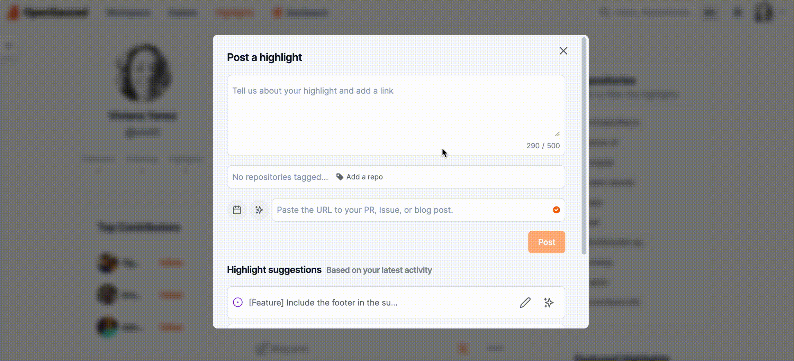

## Introduction to OpenSauced for Contributors

OpenSauced is a platform dedicated to empowering you, the contributor, as you grow in your open source journey. We offer a GitHub-powered dashboard for tracking your contributions and gaining insights into your favorite open source projects. You can also customize your Insights Pages and Lists with the repositories you choose and the contributors you want to see.

## Getting Started

To get started, you will need to create an account on OpenSauced. You can do this by visiting the [app.opensauced.pizza](https://app.opensauced.pizza) and clicking the "Connect with GitHub" button. You will be prompted to sign in with your GitHub account. Once you have signed in, you will be redirected to the OpenSauced dashboard.

## Highlights: Connecting and Recognizing Contributions

Leveraging OpenSauced's Highlights feature is a great way for maintainers to recognize and showcase the valuable contributions made to your open source projects, to curate and share key achievements, contributions, and milestones, and bring visibility to the hard work of your community.

Highlights can be used to:

- publicize issues on your repository that you'd like to match with contributors,
- share Dev.to blog posts you've written,
- celebrate PRs for your project.

### Creating a New Highlight

There are two ways to create a new highlight:

1. After clicking the [Highlights tab](https://app.opensauced.pizza/feed) in the top navigation, click the input that says "Post a highlight to show your work!"

2. From your profile, click the input that says "Post a highlight to show your work!"

After you've clicked the input, you'll see a form that allows you to create a new highlight.

There are two ways to create a highlight:

1. Paste the URL to your PR, Issue, or Dev.to blog post (shown in blue below).
2. Choose from a list of suggestions (shown in orange below).

If you're adding a blog post, you'll need to associate it to a repository by clicking the "Add a repo" button.

Finally, it's time to add the details of your highlight. You can add a description yourself or use the auto-summarize function to generate a description.

### Writing an Effective Highlight

Writing an effective highlight is key to attracting contributors to your project. Here are some tips to help you write an effective highlight:

#### Highlighting Issues

1. **Focus on the problem solved**: Begin by briefly describing the problem or challenge the issue addresses. This sets the context for why it was important.
2. **Acknowledge contributor(s)**: Mention the contributor(s) who reported or worked on the issue, recognizing their effort.
3. **Impact statement**: Explain how resolving this issue benefits the project, such as improving functionality, user experience, or security.

#### Highlighting PRs

1. **Summarize the changes**: Start with a clear summary of what the PR achieves. This could be a new feature, bug fix, or enhancement.
2. **Credit the contributors**: Acknowledge everyone who contributed to the PR, including reviewers.
3. **Highlight the value**: Explain the value of these changes to the project or its users. For instance, how it improves performance, adds a requested feature, or simplifies the codebase.

#### Highlighting Dev.to Blog Posts

1. **Capture the essence**: Begin with an interesting blog post summary, capturing the main theme or message.
2. **Discuss the relevance**: Explain why this blog post is important for your open source project or community. Is it about a major update, a community event, or sharing best practices?
3. **Engage with a call-to-action**: Encourage readers to engage with the post, whether by reading, commenting, or sharing their thoughts on the topic.

## Insights: Connecting Your Repositories

OpenSauced Insights you to see the impact of your contributions. You can use insights pages to track repositories' growth, analyze work, and connect with others.

## Why Create an Insights Page

- Personal Contribution Tracking
- Skill Development and Portfolio Building: Contributing to open source projects can be a great way to develop new skills. Your contributions can also be used as samples for your portfolio. Looking for ways to implement your open source experience in your job search journey? Check out our [job search guide](https://docs.opensauced.pizza/job-seekers-guide/job-seekers-guide-introduction/)! 😄
- Identifying Potential Projects to Contribute To: Finding open source projects to contribute to can be difficult and this feature provides you access to a whole plethora of projects for you to chose from.
Networking and Community Engagement - explanation
- Curating Collections for Interest Groups (e.g., top open source React projects)

### Creating a New Insight Page

To connect your repositories, click the "Insights" tab on the dashboard. You will be redirected to a page where you can create your new Insight Page.

There are two ways to add repositories to your Insight Page:

1. **Sync GitHub organization**: Syncing your favorite GitHub organizations is a good idea if you want to keep track of their open source project activities and trends.
2. **Connect individual repositories**:  Connecting individual repositories is a good idea if you who wants to keep track the contributions of a specific repository or group of repositories. For example, you might want to track of projects you have contributed to or would like to contribute to in the future.

### Using Your Insights Page

Once you have connected your repositories, you will be redirected to your Insight Page. Here, you will see a dashboard with an overview of the repositories and the contributors who have contributed to them.

There are three tabs that provide you with more information on these repositories:

#### Reports

The Reports tab allows paid users to filter for more information about their repositories over the last 30 days and to generate a Downloadable CSV. Filters include: Top 100 Repos, Minimum 5 Contributors, Recent, Most Active, and Spammed.

#### Repositories

The Repositories tab allows you to view more detailed information on each repository, including Activity, PR Overview, PR Velocity, Spam, Contributors, and activity over the last 30 days. To learn more about these features, see [Understanding Insights Data](https://docs.opensauced.pizza/maintainers/understanding-lists/#understanding-lists-contributor-data).

#### Contributors

The Contributors tab allows you to view more detailed information about other contributors, including Activity, Repositories, the date of their last contribution, Time Zone, and the number of contributions. This can be a great way to find other people to collaborate with.

To learn more about your contributors, you can select them and add them to a list.

There are two ways to add contributors to a list:

1. Create a new list with selected contributors.
2. Add selected contributors to an existing list.

## Lists: Connecting with Contributors

[Lists](../features/lists.md) feature helps you connect with other contributors or learn more about what others are up to in open source. With this feature, you can categorize, watch, and check out different groups of contributors within open source projects.

### What You Can Do With Lists?

There are many things you can do with this feature, but here's some ideas to get you started:

- Learn about what other contributors are doing in open source.
- Learn about new projects.
- Make connections with other contributors who share your interests and come from other backgrounds.

### Creating a New List

1. Click the "Lists" tab on the Insights hub to create a new list. You will be redirected to a page where you can create your new list.
2. Click on the "New List" button to start a new list.
3. Give your list a name.
4. Choose your page visibility. You can choose to make your list public or private. By default, it is set to private.
5. Add contributors to your list by searching for their GitHub username, syncing your GitHub Team, or importing your GitHub Following.

## Using Your List

Once you have created your list, you will be redirected to your List Page. Here, you will see a dashboard with an overview of the contributors.

There are three tabs that provide you with more information on these repositories:

### Overview

The Overview tab gives you a high-level view of the contributors in your list, including the total number of commits in the last 30 days and the types of contributors on your list: Active, New, and Alumni.

### Activity

The Activity tab gives you a graph view with more detailed information on each contributor, including the type of activity, repositories they've contributed to, and how they compare to each other.

You can filter your list by All Contributors, Active Contributors, New Contributors, and Alumni Contributors.

### Contributors

The Contributors tab gives you the list of people that have contributed to other open source projects. It also includes information like activity level, last repository contributed to, the date of their last contribution, time zone, programming languages used, and number of contributions. This can be helpful if you're looking for other people to collaborate with.

To learn more about these features, see [Understanding Lists Data](https://docs.opensauced.pizza/maintainers/understanding-lists/#understanding-lists-contributor-data).
