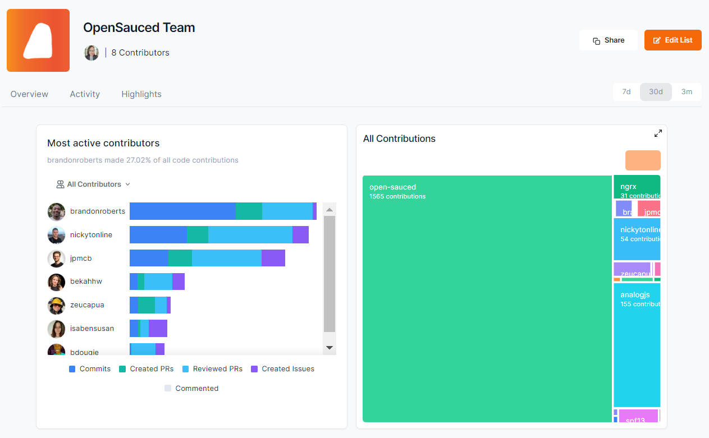

## Introduction to OpenSauced for Contributors

OpenSauced is a platform dedicated to empowering you, the contributor, in your open source journey. With OpenSauced, you can use to find repositories to contribute to, track your contributions, gain insights into your favorite open source projects, and find new open source contributors to connect with.

## Getting Started

To get started, you will need to create an account on OpenSauced. You can do this by visiting the [app.opensauced.pizza](https://app.opensauced.pizza) and clicking the "Connect with GitHub" button. You will be prompted to sign in with your GitHub account. Once you have signed in, you will be redirected to the OpenSauced dashboard. A great place to get started is by creating your profile.

## Creating Your Profile

Creating your profile is a great way to showcase your open source contributions, connect with other contributors and maintainers, and share during a job search. Here are some steps to help you get started:

1. After creating your account, navigate to Settings.

2. Once there, you will be asked to add your name, bio, links to your social media accounts, timezone, and other forms of contact information. 
  :::tip
   Don't forget to add your personal site, GitHub Sponsors URL, and LinkedIn so people can connect with you and learn more about your work.
  :::
3. In the Interests section, select the various programming languages and topics that you are interested in. This helps us recommend open source projects that fit your interests. 
4. Manage your email preferences. 

### Your Profile

Your profile is a great resource for showcasing your contributions and sharing with others the open source work you've done.

On your profile, you will see the Highlights section, which you can learn more about [here](../contributors-guide.md#highlights:connecting-and-recognizing-contributions), and three other tabs:

- **Contributions**: This tab includes a graph that shows the amount of Pull Requests you have opened, [the velocity of your Pull Requests](../welcome/glossary.md#pr-velocity), and the amount of repositories that you have contributed to. Underneath the graph, there is a "Latest PRs" chart, which shows a list of current and recent Pull Requests. This tab is helpful if you want to showcase a steady and consistent open source contribution experience.
- **Connections**: for pro accounts, you can reach out to other contributors and maintainers to collaborate on projects or to learn from them.  
- **Recommendations**: This tab includes a list of open source projects that are chosen based the programming languages you picked in the Interests section of your public profile. This is useful if you're looking for new projects to contribute to.

## Explore Tab: Finding Your Next Open Source Project

If you're looking for a new open source project to contribute to or you want to find repositories for potential job opportunites, the Explore tab is a great place to start. Here, you can find a list of open source projects and filter them by language, top repos, recent, most active and more.

Once you've selected your filters, you'll be able to see the contributors, spam, and activity level of the repository. Understanding the activity level and PR velocity of a repository can help you determine if it's a good fit for you to contribute to and what to expect when you submit a PR.

For example, if you wanted to look for a JavaScript project to contribute to, you would select "JavaScript" from the language dropdown and "Most Active" from the filter dropdown to see the most active JavaScript projects on GitHub. If you want to keep track of the repositories you're interested in contributing to, you can add them to your [Insights page](../features/insights.md).

## Highlights: Connecting and Recognizing Contributions

Leveraging OpenSauced's [Highlights](../features/highlights.md) feature is a great way for you to showcase your valuable contributions to open source projects. You can curate and share your achievements and milestones and bring visibility to your hard work.

The Highlights feature allows you to:

- Talk about issues that you raised.
- Share Dev.to blog posts that you've written.
- Display PRs that showcase your contributions.

### Creating a New Highlight

There are two ways to create a new highlight:

1. Paste the URL to your PR, Issue, or Dev.to blog post (shown in blue below).
2. Choose from a list of suggestions (shown in orange below).

If you're adding a blog post, you'll need to associate it to a repository by clicking the "Add a repo" button.

Finally, it's time to add the details of your highlight. You can write the description yourself or use the auto-summarize button to generate one.

### Writing an Effective Highlight

Sharing the story of your hard work is an opportunity to connect with the reader, which could include potential collaborators or recruiters. Here are some tips to help you write effective stories for your highlights:

#### Highlighting Issues

1. **Share your motivation**: Briefly explain why you raised the issue. For example, "I'm passionate about improving accessibility because I believe everyone should have equal access to information."
2. **Summarize the issue**: Briefly describe the issue you wrote so your readers have context. For example, "I raised an issue to add alt text to images in the project's 'About Us' page."
3. **Describe the impact:** Briefly state how the resolution of the issue will improve the project. For example, "This will help people who use screen readers to understand the content of the images."

#### Highlighting PRs

1. **Describe the PR**: Start with a clear summary of what your PR accomplishes. For example, "I added a new feature to the project's Chrome Extension that allows users to summarize content."
2. **Highlight your solution and its impact**: Briefly describe the solution, any challenges you faced, or any part of the PR you're particularly proud of. For example, "Initially, I faced challenges with the API, but I was able to resolve them by using a different endpoint."
3. **Reflect on your experience**: Mention what you learned from working on the PR. For example, "I learned a lot about the Chrome Extension API and how to use it to create new features."

#### Highlighting Dev.to Blog Posts

1. **Describe the topic**: Begin with an interesting blog post summary to help your peers and potential recruiters understand your writing.
2. **Discuss the inspiration**: Explain why you wrote this blog post. Is it to guide others on improving their coding skills, raise awareness about an issue in the tech community, or display your progress in learning a new programming language?
3. **End with a call-to-action**: Encourage readers to read and engage with the post, whether by commenting or sharing it with others on social media.

## Insights: Connecting Your Repositories

OpenSauced [Insights](../features/insights.md) allows you to track open source projects that you are interested in. You can use Insights Pages to track repositories' growth, analyze work, and connect with others.

### Why Create an Insights Page

- **To track projects you're working on**: Tracking projects you're working on can help you stay up-to-date with the latest activity, trends, and connect with other contributors.
- **To identify potential projects to contribute to**: If you're looking for a new project to contribute to, you can use the Insights feature to track active projects that are looking for contributors. You can use the Explore tool to find new projects to contribute to and track with your Insights page.
- **To network and engage with the community**: Finding people to work and connect with can be challenging. Through the feature's Contributors tab, you can connect with your network.
- **To track the activity of a topic you're interested in**: Keeping up with the latest trends and activity in a specific topic can be challenging. You can use the Insights feature to track the activity of a specific topic and find new projects to contribute to. For example, you can create an [Insight page for Active AI Repositories](https://app.opensauced.pizza/pages/BekahHW/1055/dashboard).
- **To track the activity of your favorite programming languages**: If you're interested in tracking the activity of your favorite programming languages, you can use the Insights feature to track the open source projects that are using them.
- **To aid in the job search**: If you're looking for a job, you can use the Insights feature to track the activity of the organizations you're interested in working on. This can help you understand the activity level of the repositories and the types of contributions that are being made, and even identify which company you're contribute to.
- **Curating collections for interest groups**: You can curate and share repositories focusing on sectors and programming languages that interest you. 

### Creating a New Insight Page

To track the repositories, click the "Insights" tab on the nav bar. You will be redirected to a page where you can create your new Insight Page.

There are two ways to add repositories to your Insight Page:

1. **Sync GitHub organization**: Syncing your GitHub organizations is a good idea if you want to keep track of their open source project activities and trends.
2. **Connect individual repositories**: Connecting individual repositories is a good idea if you want to keep track of the contributions of a specific repository or group of repositories. 

### Using Your Insights Page

Once you have connected your repositories, you will be redirected to your Insight Page. Here, you will see a dashboard with an overview of the repositories and the contributors who have contributed to them.

There are four tabs that provide you with more information on these repositories:

- Reports: The Reports tab allows paid users to filter for more information about their repositories over the last 30 days and to generate a downloadable CSV
- Repositories: This tab contains information such as Activity, PR Overview, PR Velocity, Spam, Contributors, and activity that has occurred over the last 30 days.
- Contributors: The Contributors tab allows you to view more detailed information about other contributors, including Activity, Repositories, the date of their last contribution, Time Zone, and the number of contributions.
- Activity: The Activity tab gives you a graph view with more detailed information on each contributor when you click their image, including their latest PRs and repositories they've contributed to.

#### Repositories

If you're looking for an active project to contribute to, this tab can help you as it contains information such as Activity, PR Overview, PR Velocity, Spam, Contributors, and activity that has occurred over the last 30 days. This information is also a good way to connect with others on the project or where to find support. To learn more about these features, see [Understanding Insights Data](../maintainers/understanding-insights.md).

#### Contributors

The Contributors tab allows you to view more detailed information about other contributors, including Activity, Repositories, the date of their last contribution, Time Zone, and the number of contributions. This can be a great way to find other people to collaborate with or recommend for jobs.

:::tip
Want to learn more about your peers?  You can select them and add them to a list.
:::

## Lists: Connecting with Contributors

The [Lists](../features/lists.md) feature helps you connect with other contributors or learn more about what others are up to in open source. With this feature, you can categorize, watch, and check out different groups of contributors within open source projects.

### What You Can Do With Lists?

There are many things you can do with this feature, but here are some ideas to get you started:

- **Tracking personal contributions**: Add repositories you contributed to and track your contributions.
- Learn about what other contributors are doing in open source.
- Connect with other contributors who share your interests and come from other backgrounds.

### Creating a New List

1. Click the "Lists" tab on the Insights hub to create a new list. You will be redirected to a page where you can create your new list.
2. Click on the "New List" button to start a new list.
3. Give your list a name.
4. Choose your page visibility. You can choose to make your list public or private. By default, it is set to private.
5. Add contributors to your list by searching for their GitHub username, syncing your GitHub Team, or importing your GitHub Following.

## Using Your List

Once you have created your list, you will be redirected to your List Page. Here, you will see a dashboard with an overview of the contributors.

There are three tabs that provide you with more information on these repositories:

### Overview

The Overview tab gives you a high-level view of the contributors in your list, including the total number of commits in the last 30 days and the types of contributors on your list: Active, New, and Alumni. This can be helpful for finding people to collaborate with or individuals to learn from.

### Activity

The Activity tab gives you a graph view with more detailed information on each contributor, including the type of activity, repositories they've contributed to, and how they compare to each other.

You can filter your list by All Contributors, Active Contributors, New Contributors, and Alumni Contributors. This could be useful if you're new to the open source community and looking for potential mentors or an experienced contributor who is looking for people to collaborate with.

### Contributors

The Contributors tab gives you the list of people that have contributed to other open source projects. It also includes information like activity level, last repository contributed to, the date of their last contribution, time zone, programming languages used, and the number of contributions.This can be helpful if you're looking for others to collaborate with.

To learn more about these features, see [Understanding Lists Data](../maintainers/understanding-lists-data.md).
