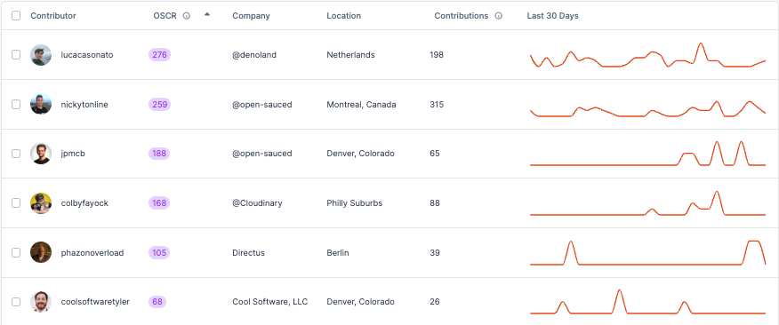

The Contributor Insights feature enables you to categorize, monitor, and analyze different groups of contributors within open source projects. With the Contributor Insights feature, gain granular insights into each contributor's activity and contributions.

Monitor individual commit histories, track who is actively engaged, identify alumni or new contributors, and even compare the performance of contributors against each other. This encompasses a wide range of metrics such as code commits, created and reviewed pull requests (PRs), as well as issue creation and commenting.

## How to Create a Contributor Insight Page

After logging in, navigate to "Insights" in the sidebar. Click the "+" next to it to be presented with options, and select "New Contributor Insight."

There are three ways to add a list:

1. **Explore Contributors**: Use our explore tool to find contributors and create your list.
2. **Sync your GitHub Team**: Connect to your GitHub to create a Contributor Insight Page from a team in your organization.
3. **Import your GitHub Following**: Connect to your GitHub to create a Contributor Insight Page with all the contributors you follow.

Once your Contributor Insight Page is created, you'll be able to see an overview of all the contributors in your list, a graph of their activity, and a detailed breakdown of the contributors.

:::tip

 If you're having trouble syncing your Organization or Team, check out the "[Sync Your GitHub Team](../welcome/faqs.md#sync-your-github-team)" section in our FAQs.

:::

By default, your Contributor Insight Page is public. If your Contributor Insight Page is private (a PRO plan feature), only those with access to your Workspace will be able to view it.

## Open Source Contributor Rating (OSCR)

On your Contributor Insight Page, you'll see that each contributor is assigned an OSCR. The OSCR is a metric to evaluate the engagement and impact of contributors across the entire open source ecosystem. This score aims to give insight into a contributor's involvement and the value they bring to open source communities as a whole.

The OSCR takes into account various factors related to all of the contributor's activity and the quality of their contributions in open source. 

:::info
OSCRs are calculated on a rolling 90-day basis across all of a contributor's activity and are out of 300 total points. This means the score reflects recent activity and engagement, providing a current snapshot of a contributor's open source involvement rather than a lifetime aggregate.
:::

### Insights into OSCR

Here are some of the ways, the OSCR can be used:

- Identifying currently active key contributors in a project
- Evaluating the current health of an open source community
- Finding potential collaborators based on recent activity
- Recognizing and rewarding impactful contributors
- Tracking contributor growth over time
- Encouraging sustained participation in open source

OSCRs are designed to be a helpful tool in understanding current open source dynamics, but should be considered alongside other factors when evaluating contributors or projects.