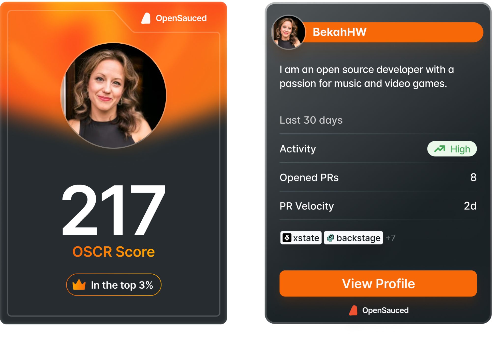

The Dev Card feature is what we like to call your "open source business card."

On the front of your card, you see your profile picture, username, and your [OSCR](https://opensauced.pizza/docs/welcome/glossary/#oscr) score. Your OSCR score is a metric that measures your open source contributions and engagement.

You'll see the back side of your card when you click it. It shows more information, including your profile headline, the number of pull requests you have created, the date of your first contribution on GitHub, activity rate, [PR velocity](https://opensauced.pizza/docs/welcome/glossary/#pr-velocity) rate, and a `View Profile` button that takes you to your dashboard.

Your Dev Card is a snapshot of your contributions, skills, and engagement in the open source community. You can share it on social media, use it to monitor your progress, or show it off to potential employers.

Eager to get your Dev Card? Here's how you can get yours today:

1. Log in to your OpenSauced account.
2. Navigate to your [profile](https://app.opensauced.pizza/user/{username}).
3. Click the Dev Card icon on your profile image.

