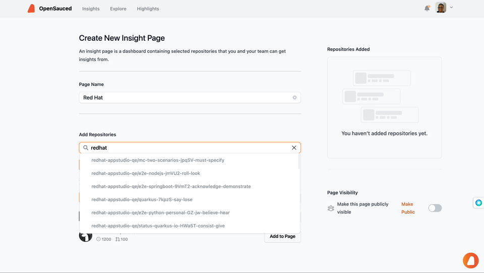

The Repository Insights feature is your one-stop solution for understanding the pulse of your open source projects and contributions. This feature is designed to provide a comprehensive view of open source project's health and contributions. From contribution trends to community health, OpenSauced Repository Insights helps you make data-driven decisions that align with your goals. It's not just about numbers; it's about providing data to help you make decisions that can define your approach to open source and tell the story of your project or contribution journey. 

## How to Use Repository Insights

### Contributors

- To track projects you're working on.
- To identify potential projects to contribute to.
- To discover other contributors to collaborate with.
- To track the activity of a topic you're interested in.
- To track the activity of your favorite programming languages.
- To aid in the job search process.

:::tip

Check out our [Contributors Guide to OpenSauced](../contributors/contributors-guide.md#repository-insights-connecting-your-repositories) to learn more about how to create and use Repository Insights as a contributor.

:::

### Maintainers

- To track the health of your project.
- To identify contributors who are making an impact.
- To find new contributors to support your project.

:::tip

Check out our [Maintainers Guide to OpenSauced](../maintainers/maintainers-guide.md) and our [Understanding Repository Insights Data](../maintainers/understanding-repo-insights.md) pages to learn more about how to create and use Repository Insights as a maintainer.

:::

## Sharing Your Repository Insights Page with Your Team

After you've created your Repository Insights Page, share it with your team.

Sharing this page with your team ensures that everyone is well-informed about the project's status and can collaborate more effectively. It fosters a collaborative environment where team members can align their efforts, make informed decisions, and collectively work toward the organization's success.

### How to Share Repository Insights Page

This method gives view-only access to your Repository Insights Page.

1. Navigate to your sidebar.
2. Click the Repository Insight Page that you want to share.
3. On the top right, click the "Share" button to copy the Repository Insight Page URL to the clipboard.
4. Share the URL with your team members.

By default, your Repository Insights are public. If you want to make your Repository Insights private, you can upgrade your account to a PRO plan.