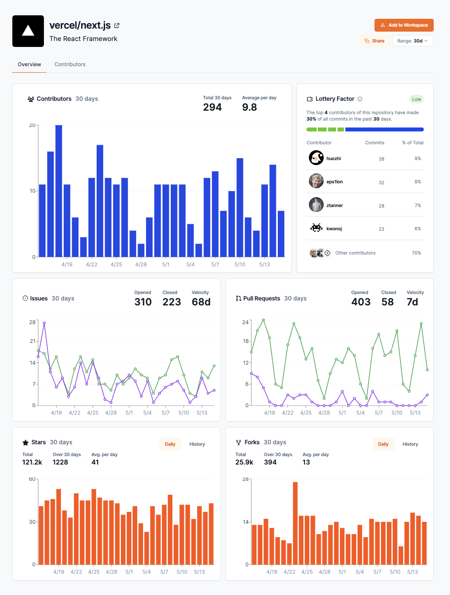

Repository Pages allow you to view specific information about a repository hosted on GitHub through a detailed visual and analytical representation of the project.

These pages are designed to help you gain insights into various aspects of project activity, health, and community engagement.

## Accessing a Repository Page

There are a couple of ways to access a repository page:

1. **From the Repository Insights Page**: If you're already on the Repository Insights Page, you can click on the repository name to view the repository page.
2. **From the search bar**: You can search for a repository by entering the repository name in the search bar. Once you find the repository you're looking for, click on the repository name to view the repository page.
3. **Directly from the URL**: You can also access a repository page directly by entering the URL in your web browser: 

    ```text
    https://app.opensauced.pizza/s/{org}/{repo}
    ```

    Replace `{org}` with the name of the organization that owns the repository you want to view. Replace `{repo}` with the name of the specific repository.

    For example, to view the `next.js` repository created by the `Vercel` organization, you would use the following URL:

    [https://app.opensauced.pizza/s/vercel/next.js](https://app.opensauced.pizza/s/vercel/next.js)

    Here's what that will look like:

    [](https://app.opensauced.pizza/s/vercel/next.js) 

## Understanding the Repository Page

### Overview Dashboard

The charts on our repository pages offer a visual representation of several key metrics:

- **Issue Resolution Trends**: Our line graphs display the number of issues opened versus those closed within specified periods, offering insights into the effectiveness of problem resolution and how issue volume changes over time.
- **Pull Request Dynamics**: Analyze pull request activity by the numbers of pull requests opened, closed, and merged. This provides an overview of collaboration efficiency and code review processes.
- **Stars and Forks Over Time**: The number of stars and forks the project receives over time, illustrating the project's growth in popularity and its spread within the developer community.
- **[Lottery Factor](../welcome/glossary.md#lottery-factor)**: This unique metric highlights the dependency on key contributors. A project is considered vulnerable if 2 or fewer contributors account for 50% or more of the project's contributions. This indicates a potential risk if one of these contributors leaves the project.

You can use the time range filter to view the number of stars and forks over different periods, such as the last 7 days, month, or the last year.

### Contributor Dashboard

The Contributor Dashboard offers a comprehensive view of all contributors, showcasing the frequency and size of each person’s contributions. 

Currently, only publicly available repositories on GitHub can be viewed through repository pages.

Repository pages provide a way to explore and learn about open source projects on GitHub. While you cannot create or edit them directly on Open Sauced Pizza yet, you can add them to your [Repository Insight pages](https://docs.opensauced.pizza/features/repo-insights/). 