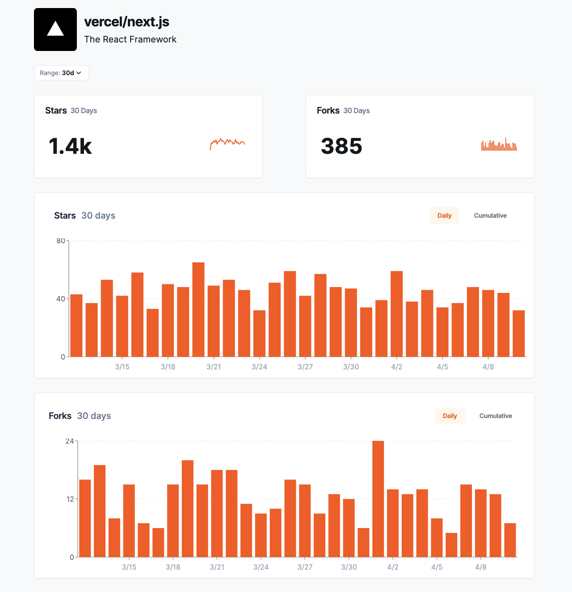

Repository pages allow you to view specific information (forks and stars) about a repository hosted on GitHub.

## Accessing a Repository Page

To view a repository page, follow these steps:

Open a web browser and navigate to the following URL structure:
`https://app.opensauced.pizza/s/{org}/{repo}`

Replace {org} with the name of the organization that owns the repository you want to view. Replace {repo} with the name of the specific repository.

For example, to view the `next.js` repository created by the `Vercel` organization, you would use the following URL:

[https://app.opensauced.pizza/s/vercel/nextjs](https://app.opensauced.pizza/s/vercel/nextjs)

Here's what that will look like:

## Understanding the Repository Page

Here are some general things you might find on a repository page:

- **Repository name and organization/user**: This is displayed prominently at the top of the page.
- **Metrics**: This includes the number of stars and forks the repository has on GitHub.

You can use the time range filter to view the number of stars and forks over different periods, such as the last 7 days, month, or the last year.

Currently, only publicly available repositories on GitHub can be viewed through Open Sauced Pizza's repository pages.

Repository pages on Open Sauced Pizza provide a way to explore and learn about open source code repositories hosted on GitHub. While you cannot create or edit them directly on Open Sauced Pizza yet, you can add them to your [Repository Insight pages](https://docs.opensauced.pizza/features/repo-insights/). 