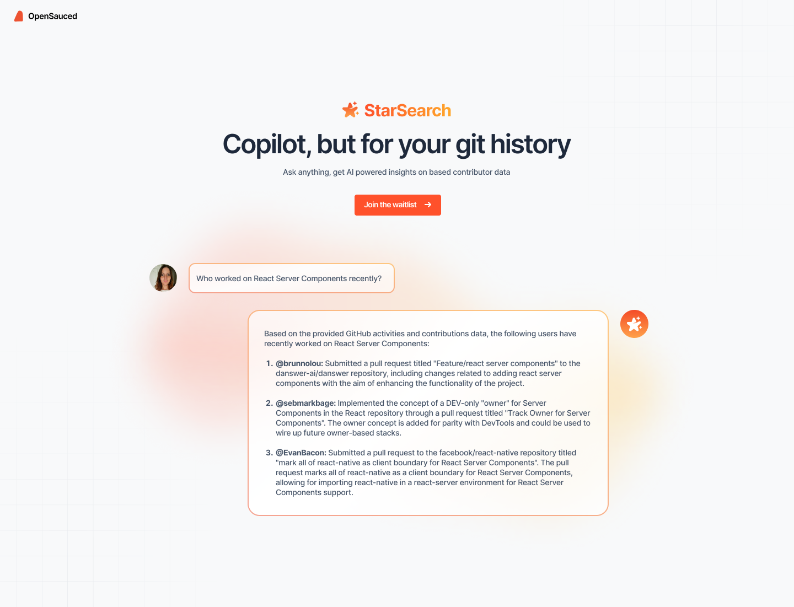

**StarSearch** is our AI-powered feature that provides in-depth insights into contributor history and activities, enabling users to query GitHub activities and analytics through natural language. This tool is designed to provide you with insights into GitHub projects and contributions without requiring any coding or complex queries, bringing transparency and a new depth of knowledge about open source projects. It's your copilot for git history.

## Key Features

- **Real-Time Insights**: Access up-to-date information about GitHub contributions, issues, and projects.
- **Conversational Queries**: Use natural language to explore GitHub data.
- **Cross-Project Analysis**: Identify connections between different projects and technologies.
- **Contributor Discovery**: Pinpoint key contributors and the work they've done.

### What Can You Discover with StarSearch?

- **Contributor Activities**: Learn the details of contributions and contributors.
- **Key Contributors**: Identify the key contributors to projects and ecosystems and their impact on the projects.
- **Work-Based Connections**: Find potential collaborators based on their contributions to specific projects.
- **Hidden Experts**: Discover untapped talent in the ecosystem.

## Getting Started with StarSearch

1. Log in to [Your OpenSauced Account](https://app.opensauced.pizza/)
2. Navigate to [https://app.opensauced.pizza/star-search](https://app.opensauced.pizza/star-search) or click the StarSearch tab in the sidebar or navigation bar.

### User Guide

#### Basic Queries

- What type of pull requests has \{username} worked on?
- Who are the best developers that know \{technology} and are interested in \{technology}?
- Who are the most prevalent contributors to the \{technology} ecosystem?
- Show me the [lottery factor](https://docs.opensauced.pizza/welcome/glossary/#lottery-factor) for contributors in the \{repository} project?

### FAQs

- **Can I continue conversations with StarSearch?**
   - Not yet, but stay tuned!
- **Can I access my search history?**
   - This feature is currently not available, but we plan to include it in future updates.
- **What time range does StarSearch cover?**
   - StarSearch is most accurate from March 1, 2024.
- **Is StarSearch always right?**
    - StarSearch is an AI tool and may not always be accurate. We recommend verifying the information.

## Feedback

Your feedback helps us improve StarSearch. If you have any suggestions or questions, please create a [discussion post](https://github.com/orgs/open-sauced/discussions/categories/general-feedback-or-bugs) or open an [issue](https://github.com/open-sauced/app/issues). You can also use the thumbs-up or thumbs-down buttons on the StarSearch page to let us know if the information was helpful.