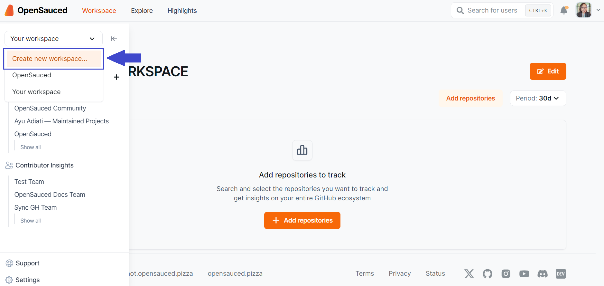

In the OpenSauced app, your work unfolds within a Workspace: a virtual environment for managing information—whether for individual productivity, team collaboration, or company-wide operations. Workspaces serve as a centralized hub for sharing, collaborating on, and monitoring open source projects and their contributors. This feature is designed to streamline your open source involvement, making it more efficient and interconnected.

## Understanding Workspaces

You can navigate your workspaces from the sidebar. Each workspace has its own dashboard, which includes the repositories you're tracking in the workspace.

By default, all workspaces are public. This means that anyone with the link to your workspace can view it and all of your Insight Pages. If you want to make your workspace private, you can upgrade your account to a paid plan.

### The Sidebar

The expandable sidebar includes:

- Options for creating and viewing workspaces.
- Access to your Contributor and Repository Insights pages.
- Links to support.

:::info

We recently had a naming change. The [Contributors Insights](contributor-insights.md) feature was previously called Lists, and the [Repositories Insights](./repo-insights.md) feature was previously called Insights.

:::

### Your Workspaces

In your workspace dashboards, you can create, view, and manage your workspaces.

#### Repositories Dashboard

Within the repositories dashboard, you can view the following metrics, which are over a period of thirty days by default:

- **Pull Requests**: This includes the total opened and merged pull requests for the repositories included in your workspace, as well as the velocity of pull requests being merged.
- **Issues**: This includes the total opened and closed issues for the repositories included in your workspace, as well as the velocity of issues being closed.
- **Engagement**: This includes the total stars, forks, and activity ratio for the repositories included in your workspace.

## How to Create or Access a Workspace

To create a workspace, start by accessing the **Workspace switcher** in the sidebar. From there, you can create a new workspace or view an existing one.

 

:::note

Whenever you select "Home", you'll be taken to the last workspace you opened.

:::

### How to Add Repositories to a Workspace

If you're creating a new workspace, you'll have the option to add repositories at the time of creation.

Start by creating a workspace name, then click "Add repositories." You'll have three options for adding repositories:

1. **Search for Repositories**: Use our search tool by adding an organization name, followed by the repository name, and add them to your workspace.
2. **Import a GitHub Organization**: Connect to your GitHub organizations to create a workspace from an organization.
3. **Import Repositories**: Paste a list of repositories to add to your workspace.

Once your repositories are added, you'll be able to see them in your repository dashboard. You can also edit your workspace to add or remove repositories anytime.

### Changing Workspaces

Anything you create in a workspace is specific to that workspace. When you switch workspaces, you'll see the repositories and contributors specific to that workspace.

## How to Share a Workspace

You can share your workspace with others by copying the URL and sending it to them. If your workspace is private (a PRO plan feature), only those with access to the workspace will be able to view it.

## Team Workspaces

Team workspaces are part of the PRO plan and are designed to help teams collaborate on and understand open source projects. Team workspaces are public by default. However, you can switch it to private in your settings so only team members can view the workspace.

By upgrading to a team workspace, you'll have unlimited contributor and repository insights, as well as the ability to toggle between private and public visibility. 

:::info

The visibility of your insights pages is determined by the visibility of the workspace. If your workspace is public, your insights will be public. If your workspace is private, your insights will be private.

:::

You can add someone to your workspace by clicking on the "Edit" button located at the top right of the workspace dashboard and entering the username of the workspace member you would like to add.

Once you add a member to a workspace, they will be able to view the workspace and its contents. You will also be able to edit their permissions for the workspace, including giving them edit and owner permissions.
