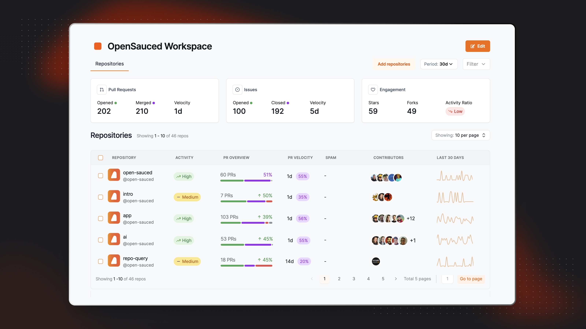

In the OpenSauced app, your work unfolds within a Workspace, a virtual environment designed to organize information for yourself, collaborating as a team, or operating across an entire company. Workspaces are a place to share, collaborate, and track open source projects and  contributors.

## Understanding Workspaces

You can navigate your workspaces from the sidebar. Each workspace has its own dashboard, which includes the repositories you're tracking in the workspace.

By default, all workspaces are public. This means that anyone with the link to your workspace can view it. If you want to make your workspace private, you can upgrade your account to a paid plan.

### The Sidebar

The expandable sidebar includes:

 - Options for creating and viewing workspaces.
 - Access to your Contributor and Repository Insights pages.
 - Links to support.

 

:::tip

 We recently had a naming change. The Contributors Insights section was previously called [Lists](contributor-insights.md), and the Repositories Insights section was previously called [Insights](./repo-insights.md).

:::

### Your Workspaces

In your workspace dashboards, you can create, view, and manage your workspaces. 

#### Repositories Dashboard

Within the repositories dashboard, you can view the following metrics, which are over a period of thirty days by default:

- **Pull Requests**: This includes the total Opened and Merged Pull Requests for the repositories included in your workspace, as well as the velocity of pull requestions being merged.
- **Issues**: This includes the total Opened and Closed Issues for the repositories included in your workspace, as well as the velocity of issues being closed.
- **Engagement**: This includes the total stars, forks, and activity ratio for the repositories included in your workspace.

## How to Create or Access a Workspace

To create a workspace, start by accessing the **Workspace switcher** in the sidebar. From there, you can create a new workspace or view an existing one.

### How to Add Repositories to a Workspace

If you're creating a new workspace, you'll have the option to add repositories at the time of creation.

Start by creating a Workspace name, and then click `Add repositories`. You'll have three options for adding repositories:

1. **Search for Repositories**: Use our search tool by adding an organization name, followed by the repository name and add them to your workspace.
2. **Import a GitHub Organization**: Connect to your GitHub organizations to create a workspace from an organization.
3. **Import Repositories**: Paste a list of repositories to add to your workspace.

Once your repositories are added, you'll be able to see them in your repository dashboard. You can also edit your workspace to add or remove repositories at any time.