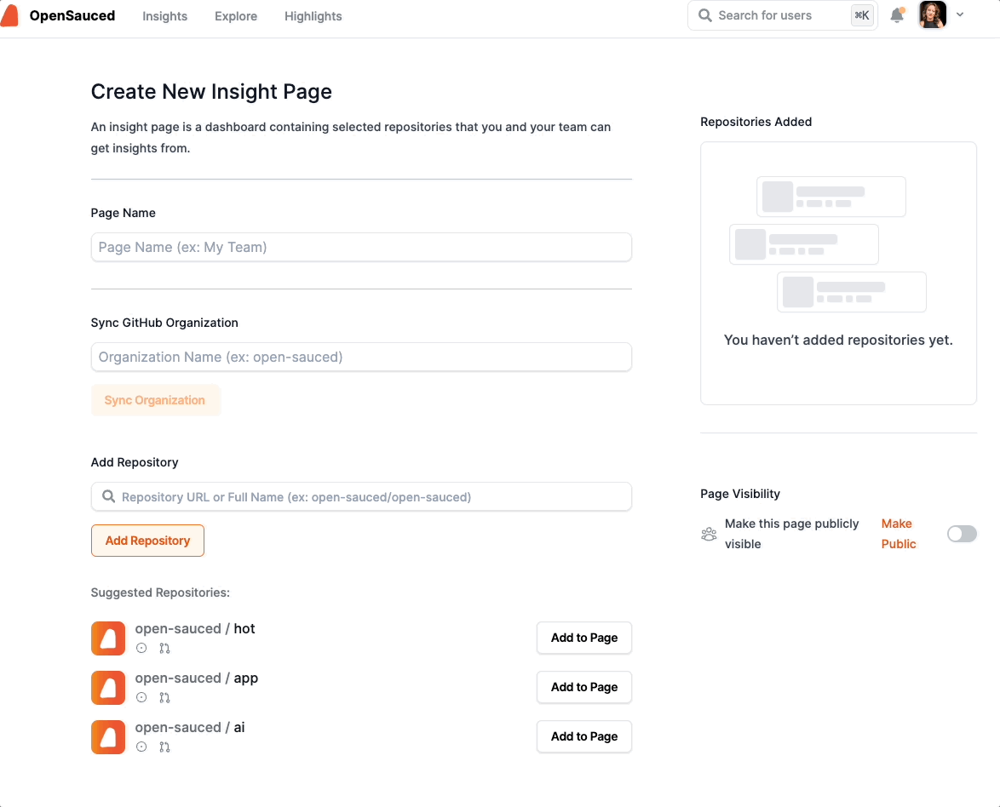

## Introduction to OpenSauced for Maintainers
OpenSauced is a platform dedicated to empowering maintainers and redefining open source contributions. We offer a GitHub-powered dashboard for tracking contributions and gaining insights into your open source projects. You can customize your Insights pages and lists with the repositories you choose and with the contributors you want to see. 

You can connect with your team and contributors through our platform and invite them to join OpenSauced. We also offer a GitHub browser extension that allows you to view your contributors' OpenSauced profiles and invite them to join OpenSauced with a single click.

## Getting Started
To get started, you will need to create an account on OpenSauced. You can do this by visiting [app.opensauced.pizza](https://app.opensauced.pizza) and clicking the "Connect with GitHub" button. You will be prompted to sign in with your GitHub account. Once you have signed in, you will be redirected to the OpenSauced dashboard.

## Insights: Connecting Your Repositories
OpenSauced Insights provides maintainers with a visual representation of their project's health and contributor engagement. It offers real-time data and analytics to understand contribution patterns, identify key contributors, and measure the project's growth. Insights can help you to assess team activity, understand when bottlenecks occur, identify where resource allocation is needed, plan and identify key contributors, understand contributor churn, or spot emerging trends.

Insights features allow you to:
- track the contributions of a specific team, a specific repository, or group of repositories
- view the number of pull requests that are open, closed, in draft, and merged
- view the average number of days it takes for a pull request to be merged (PR velocity)
- identify the top contributors to your project
- identify the current activity level and trends in activity of your contributors

### Creating a New Insight Page
To connect your repositories, click the "Insights" tab on the dashboard. You will be redirected to a page where you can create your new insight page.

There are two ways to add repositories to your Insight Page:
1. **Sync GitHub Organization**. Syncing your GitHub organization is a good idea for someone who seeks a comprehensive, unified view of your organization's open source project activities and trends, enabling streamlined management, strategic decision-making, and efficient allocation of resources across multiple repositories.
2. **Connect Individual Repositories**. Connecting individual repositories is a good idea for someone who wants to track the contributions of a specific repository or group of repositories. For example, you might want to track projects you maintain that are not under the same org or you may want to track projects that align with your team's objectives. 

### Using Your Insights Page
Once you have connected your repositories, you will be redirected to your Insight Page. Here you will see a dashboard with an overview  of the repositories and the contributors who have contributed to them. 

There are three tabs that provide you with more information on these repositories.

#### Reports
The reports tab allows paid users to filter for more information about their repositories over the last thirty days and to generate a Downloadable CSV. Filters include: Minumum 5 Contributors, Recent, Most Active, and Spammed.

#### Repositories
The repositories tab allows you to view more detailed information on each of the repositories, including Activity, PR Overview, PR Velocity, Spam, Contributors, and activity over the last 30 days. To learn more about these features, see [Understanding Insights Data](#understanding-insights-data).

#### Contributors
The contributors tab allows you to view more detailed information on each of the contributors, including Activity, Repositorites, the date of their last contribution, time zone, and number of contributions. 

To learn more about your contributors, you can select them and add them to a list. 

There are two ways to add contributors to a list:
1. Create a new list with selected contributors.
2. Add selected contributors to an existing list.

## Lists: Connecting with Contributors
OpenSauced Lists feature allows you to categorize, monitor, and analyze various groups of contributors. You can use lists to track the contributions of a specific team, a specific repository, or group of repositories. This feature offers granular insights into each contributor's activities and contributions, helping maintainers to track individual contribution histories, identify active engagement, recognize new or alumni contributors, and compare the performance of different contributors.

The Lists features allow you to:
- track the commits and PRs of the contributors on your list
- filter your contributors by their activity level, including most active, new, and alumni
- view the the repositories that your contributors have contributed to, the languages they've used for their contributions, and their time zones.

### Why Create a List?
There are many reasons to create a list, but here's some inspiration to get you started:
- **Interacting Contributors**: Keep tabs on contributors actively interacting with your repository.
- **Organization's Developers**: Monitor the contributions and performance of your internal team.
- **VIP Contributors**: Highlight and track at least 5 developers who are key maintainers or significant contributors.
- **Sales Leads**: Identify contributors whose engagement could potentially be turned into sales opportunities.
- **Potential Hires**: Observe contributors who exhibit skill and commitment, making them prime candidates for hiring.
- **Alumni Contributors**: Keep an eye on contributors who have decreased their engagement or left the project.

### Creating a New List
1. To create a new list, click the "Lists" tab on the Insights' hub. You will be redirected to a page where you can create your new list.
2. Click on the 'New List' button to start a new list.
3. Give your list a name.
4. Choose your page visibility. You can choose to make your list public or private.
4. Add contributors to your list by searching for their GitHub username, syncing your GitHub Team, or by importing your GitHub Following. 

## Using Your List
Once you have created your list, you will be redirected to your list page. Here you will see a dashboard with an overview  of the repositories and the contributors who have contributed to them. 

There are three tabs that provide you with more information on these repositories.

### Overview
The Overview view gives you a high-level view of the contibutors in your list, including the total number of commits in the last 30 days and the types of contributors on your list: active, new, and alumni.

### Activity
The Activity tab gives you a graph view with more detailed information on each of the contributors, including type of activity, repositories they've contributed to, and how they compare to each other. 

You can filter your list by all contributors, active contributors, new contributors, and alumni contributors.

### Contributors
The contributors view, gives you the list of the contributors and includes information like activity level, last repository contributed to, the date of their last contribution, time zone, programming languages used, and number of contributions.

 To learn more about these features, see [Understanding Lists Data](#understanding-lists-data).
