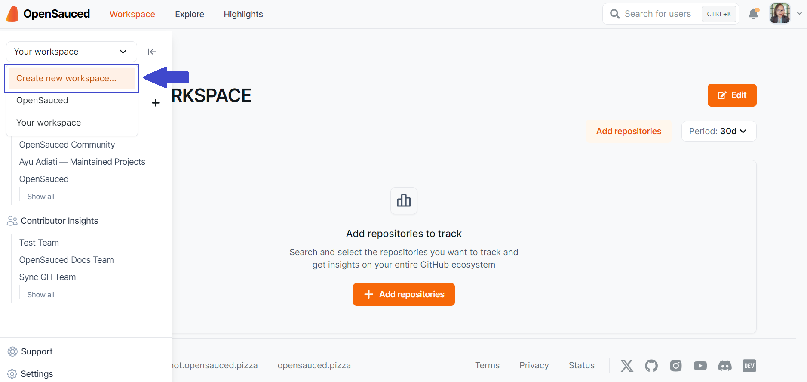
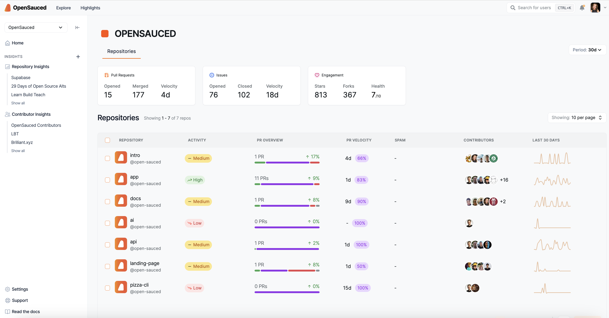
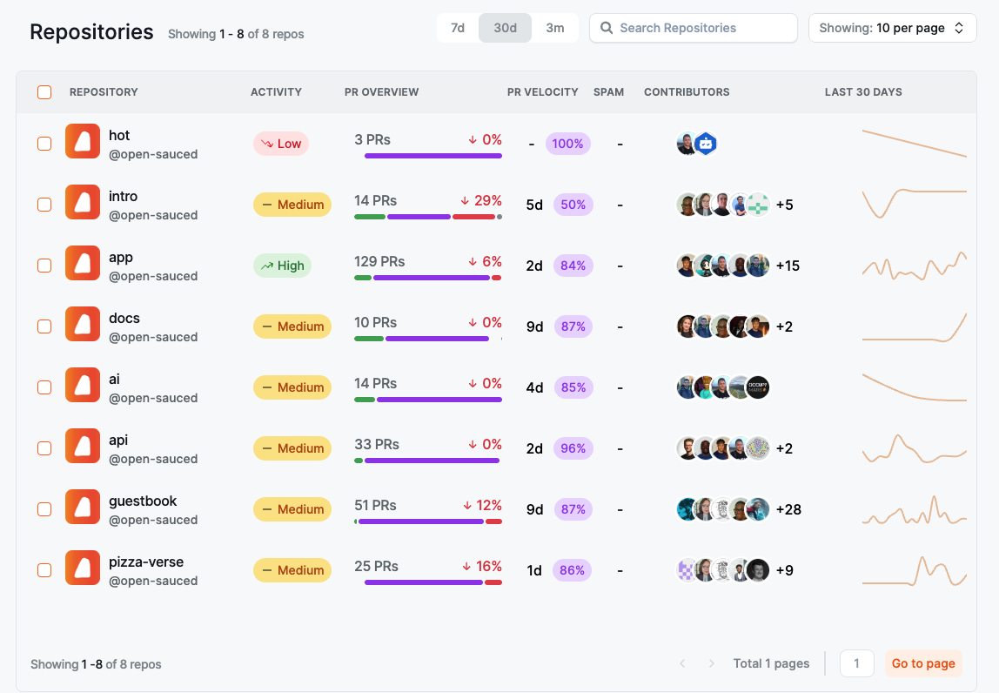
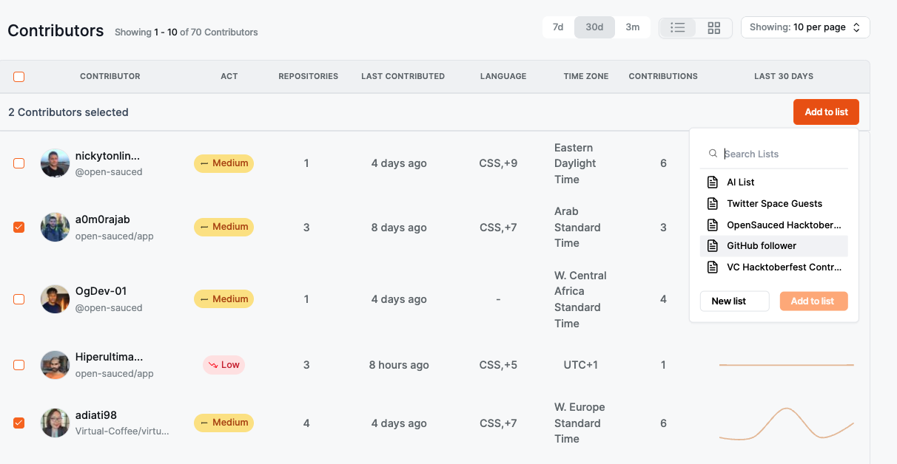
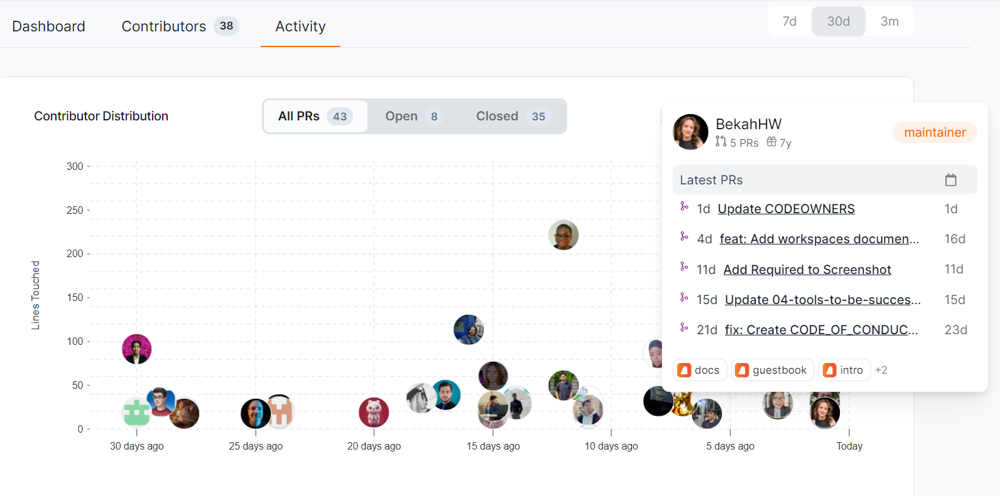
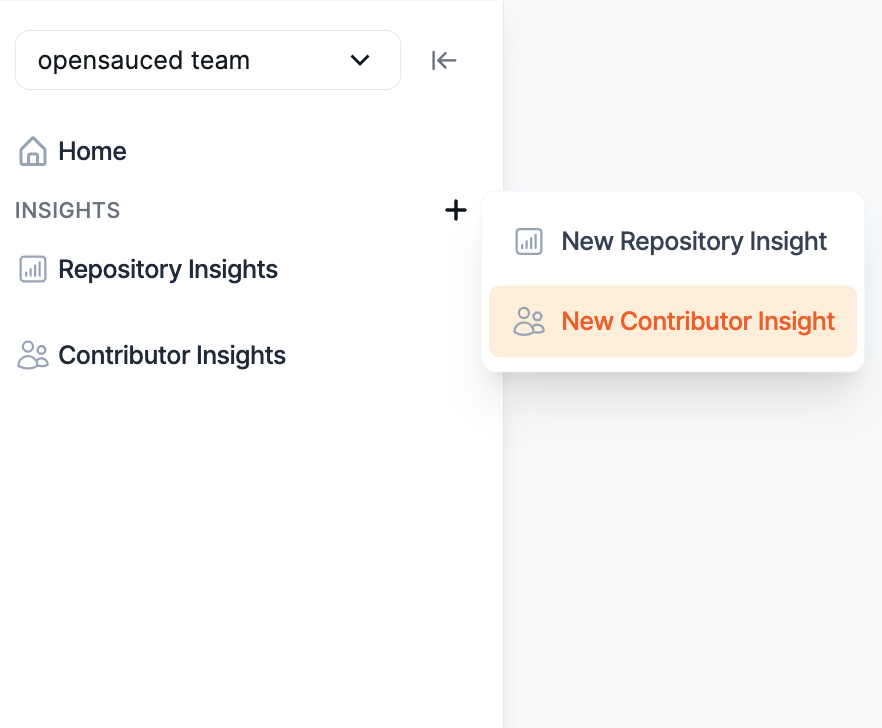
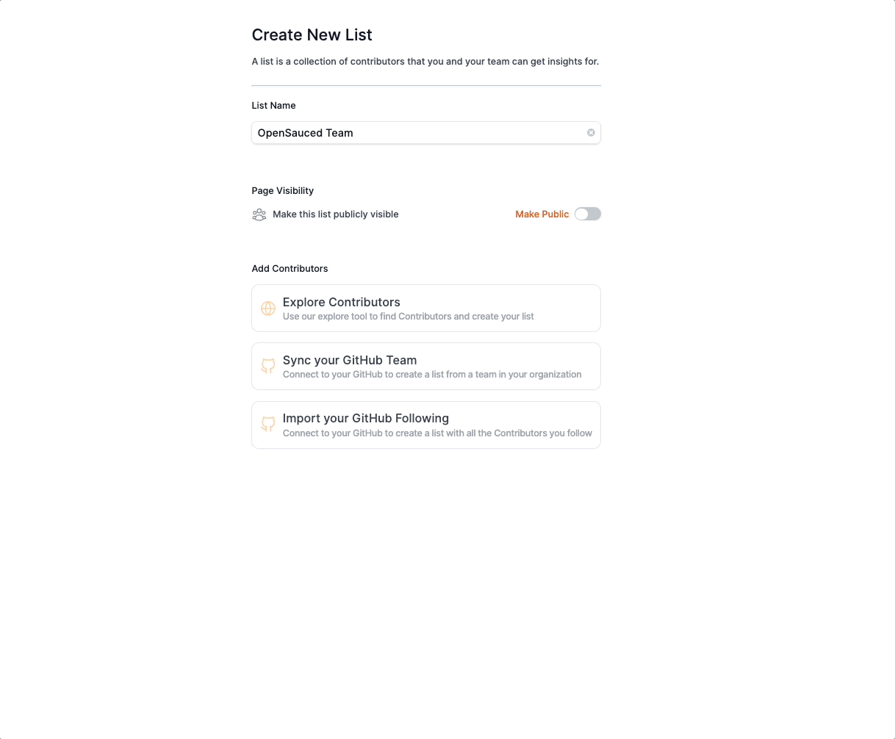
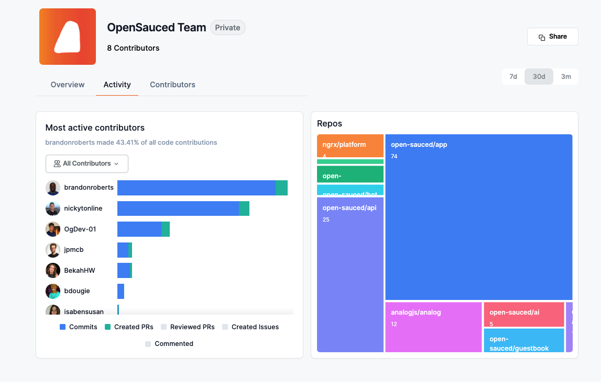
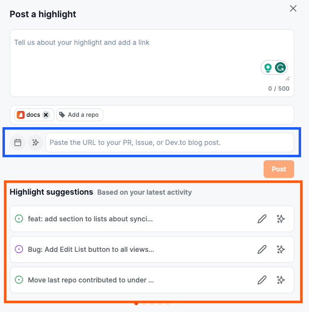
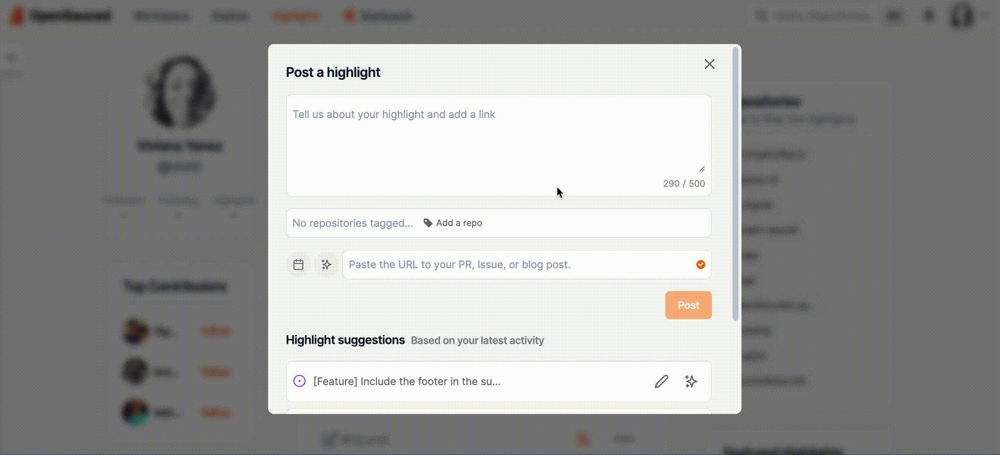

## Introduction to OpenSauced for Maintainers

OpenSauced is a platform dedicated to empowering maintainers and redefining open source contributions. We offer a GitHub-powered dashboard for tracking contributions and gaining insights into your open source projects. You can create a [Workspace](#your-workspace-streamlining-open-source-project-management) to collaborate with your team and customize your [Repository Insights](#repository-insights-connecting-your-repositories) and [Contributor Insights](#contributor-insights-connecting-with-contributors) with the repositories you choose and the contributors you want to see.

## Getting Started

To get started, you will need to create an account on OpenSauced. You can do this by visiting the [app.opensauced.pizza](https://app.opensauced.pizza) and clicking the "Connect with GitHub" button. You will be prompted to sign in with your GitHub account. Once you have signed in, you will be redirected to your Workspace.

## Your Workspace: Streamlining Open Source Project Management

When you're working with a team, managing multiple projects or even an assortment of repositories within a single project can become overwhelming, especially as you try to keep everyone up-to-date on key information that impacts your projects. Understanding the direction and value of your project can be challenging. To navigate these challenges effectively, you can use Workspaces to:

- **Understand your project at a high level**: Being able to look at all your repositories and understand them at a high level makes it easier for you to share this information, collaborate with others, and understand where your projects stand in terms of health.
- **Collaborate and create transparency with your team**: Understanding the activity for all of your projects equips you to make decisions as a team, set goals for your projects, and understand what brings the most value to those using your project. 
- **Streamline contributor engagement**: Having a high level understanding of your project is a good step in understanding your project’s value, but really understanding what’s happening beneath the surface is the next step in being able to assess project health, growth, and the contributor community. 
- **Measure and share success**:  Without insight into your project's activity level, health, and contributor community, it can be a challenge to show the value of your projects. Having real-time analytics on your projects can help you to highlight your key achievements, recognize the impact of your contributors, and communicate the hard work that’s been put into your projects.

Workspaces is a feature designed to provide maintainers and teams with a centralized platform for organizing, tracking, and analyzing their open source activity. Workspaces gives you a holistic view of project health, team collaboration, and contributor engagement.

### Creating a New Workspace

To create a workspace, start by accessing the **Workspace switcher** in the sidebar. From there, you can create a new workspace or view an existing one.

 

:::note

Whenever you select "Home", you'll be taken to the last workspace you opened.

:::

### Adding Repositories to Your Workspace

If you're creating a new workspace, you'll have the option to add repositories at the time of creation.

Start by creating a workspace name, then click "Add repositories." You'll have three options for adding repositories:

1. **Search for Repositories**: Use our search tool by adding an organization name, followed by the repository name, and add them to your workspace.
2. **Import a GitHub Organization**: Connect to your GitHub organizations to create a workspace from an organization. (If you're having trouble with this, see the "[Sync Your GitHub Team](../welcome/faqs.md#sync-your-github-team)" section in our FAQs.)
3. **Import Repositories**: Paste a list of repositories to add to your workspace.

Once your repositories are added, you'll be able to see them in your repository dashboard. You can also edit your workspace to add or remove repositories anytime.

### Navigating Your Workspace

Once your repositories are connected, you'll enter your Workspace dashboard. In your workspace dashboards, you can create, view, and manage your workspaces.

#### Repositories Dashboard

Within the repositories dashboard, you can view the following metrics, which are over a period of thirty days by default:

- **Pull Requests**: This includes the total opened and merged pull requests for the repositories included in your workspace, as well as the velocity of pull requests being merged.
- **Issues**: This includes the total opened and closed issues for the repositories included in your workspace, as well as the velocity of issues being closed.
- **Engagement**: This includes the total stars, forks, and activity ratio for the repositories included in your workspace.

Using Workspaces is a new way of approaching open source project management. By centralizing the oversight of your projects and facilitating team collaboration, Workspaces help you to make informed decisions, prioritize effectively, and foster a thriving open source community.

Beyond workspaces, you may want to get insights into other repositories and contributors to help you understand the health and growth of your projects. One way to do that is through Repository Insights.

## Repository Insights: Connecting Your Repositories

OpenSauced Repository Insights provides maintainers with a visual representation of their project's health and contributor engagement. It offers real-time data and analytics to understand contribution patterns, identify key contributors, and measure the project's growth. Repository Insights can help you assess team activity, understand when bottlenecks occur, identify where resource allocation is needed, plan and identify key contributors, understand alumni contributors, or spot emerging trends.

The Repository Insights feature allows you to:

- track the contributions of a specific team, a specific repository, or a group of repositories,
- view the number of PRs that are open, closed, in draft, and merged,
- view the average number of days it takes for a PR to be merged (PR velocity),
- identify the top contributors to your project,
- identify the current activity level and trends in the activity of your contributors.

### Creating a New Repository Insight Page

To connect and track your repositories, click the "+" next to "Insights" in the sidebar, then select "New Repository Insight." You will be redirected to a page where you can create your new Repository Insight Page.

There are two ways to add repositories to your Repository Insight Page:

1. **Sync GitHub organization**. Syncing your GitHub organization is a good idea for someone who seeks a comprehensive, unified view of your organization's open source project activities and trends, enabling streamlined management, strategic decision-making, and efficient allocation of resources across multiple repositories.
2. **Connect individual repositories**. Connecting individual repositories is a good idea for someone who wants to track the contributions of a specific repository or group of repositories. For example, you might want to track projects you maintain that are not under the same organization, or you may want to track projects that align with your team's objectives.

### Using Your Repository Insights Page

Once you have connected your repositories, you will be redirected to your Repository Insight Page. Here, you will see a dashboard with an overview of the repositories and the contributors who have contributed to them.

There are three tabs that provide you with more information on these repositories:

#### Repositories Dashboard

This tab allows you to view more detailed information on each repository, including activity levels, PR overview, PR velocity, spam PRs, contributors, and activity stats over the last 30 days.

:::note

To learn and understand more about the data provided, see [Understanding Repository Insights Data](understanding-repo-insights.md).

:::

#### Contributors

The "Contributors" tab allows you to view more detailed information on each contributor, including their activity levels, the number of repositories they contributed to, the date of their last contribution, their most used language, their time zone, the number of contributions, and their activity stats over the last 30 days.

You can select and add your contributors to a [Contributor Insight Page](#contributor-insights-connecting-with-contributors) to learn more about them.

There are two ways to add selected contributors to a Contributor Insight Page:

1. Create a new list.
2. Add them to an existing list.

#### Activity

The "Activity" tab shows a graph of the last time each contributor created their PR and how many lines of code they've touched. It also provides more detailed information on each contributor when you hover over their image, including their latest PRs and repositories they've contributed to. Clicking their image will bring you to their profile on OpenSauced.

You can use the information in this tab to help you learn about their engagement and general interests. It will be helpful if you want to collaborate with them or consider recruiting a maintainer for your project.

## Contributor Insights: Connecting with Contributors

OpenSauced Contributor Insights feature allows you to categorize, monitor, and analyze various groups of contributors. You can use Contributor Insights to track the contributions of a specific team, a specific repository, or a group of repositories. This feature offers granular insights into each contributor's activities and contributions, helping maintainers to track individual contribution histories, identify active engagement, recognize new or alumni contributors, and compare the performance of different contributors.

The Contributor Insights features allow you to:

- track the commits and PRs of the contributors on your list,
- filter your contributors by their activity level, including most active, new, and alumni,
- view the repositories your contributors have contributed to, the top programming languages they've used, and their time zones.

### Why Create a Contributor Insight Page?

There are many reasons to create a Contributor Insight Page, but here's some inspiration to get you started:

- **Interacting contributors**: Keep tabs on contributors actively interacting with your repository.
- **Organization's developers**: Monitor the contributions and performance of your internal team.
- **VIP contributors**: Highlight and track contributors you've identified as key maintainers or significant contributors.
- **Sales leads**: Identify contributors whose engagement could potentially be turned into sales opportunities.
- **Potential hires**: Observe contributors who exhibit skill and commitment, making them prime candidates for hiring.
- **Alumni contributors**: Keep an eye on contributors who have decreased their engagement or left the project.

### Creating a New Contributor Insight Page

1. Click the "+" next to "Insights" in the sidebar.
2. Click "New Contributor Insight." You will be redirected to a page where you can create your new Contributor Insight Page.

   

3. Give your page a name.
4. Add contributors to your page by searching for their GitHub username, syncing your GitHub Team, or importing your GitHub Following.
5. Once your page is created, you can edit and choose to make it public or private. By default, it is set to public. To create a private page, you can upgrade your account to a paid plan.

   

## Using Your Contributor Insight Page

Once you have created your page, you will be redirected to your Contributor Insight Page. Here, you will see a dashboard with an overview of the contributors.

There are three tabs that provide you with more information on these repositories:

### Overview

The "Overview" tab gives you a high-level view of the contributors in your Contributor Insight Page, including the total number of commits in the last 30 days and the types of contributors: [Active](../welcome/glossary.md#active-contributors), [New](../welcome/glossary.md#new-contributors), and [Alumni](../welcome/glossary.md#alumni-contributors).

### Activity

The "Activity" tab gives you a graph view with more detailed information on each contributor, including the type of activity, repositories they've contributed to, and how they compare to each other.

You can filter your Contributor Insight Page by All Contributors, Active Contributors, New Contributors, and Alumni Contributors.

### Highlights

The "Highlights" tab gives you a list of the highlights that the contributors listed on your page have created. This is a great way to see what other contributors are up to and to show them support.

:::note

To learn and understand more about the data provided, see [Understanding Contributor Insights Data](understanding-contrib-insights.md).

:::

## Highlights: Connecting and Recognizing Contributions

Leveraging OpenSauced's Highlights feature is a great way for maintainers to recognize and showcase the valuable contributions made to your open source projects, curate and share key achievements, contributions, and milestones, and bring visibility to the hard work of your community.

Highlights can be used to:

- publicize issues on your repository that you'd like to match with contributors,
- share blog posts you've written,
- celebrate PRs for your project.

### Creating a New Highlight

There are two ways to create a new highlight:

1. After clicking the "Highlights" tab in the top navigation, click the input that says "Post a highlight to show your work!"

2. From your profile, click the input that says "Post a highlight to show your work!"

After you've clicked the input, you'll see a form that allows you to create a new highlight.

There are two ways to create a highlight:

1. Paste the URL to your PR, issue, or blog post (shown in blue below).
2. Choose from a list of suggestions (shown in orange below).

:::note

If you're adding a blog post, you'll need to associate it to a repository by clicking the "Add a repo" button.

:::

Finally, it's time to add the details of your highlight. You can add a description yourself or use the auto-summarize function to generate a description.

### Writing an Effective Highlight

Writing an effective highlight is key to attracting contributors to your project. Here are some tips to help you write an effective highlight:

#### Highlighting Issues

1. **Focus on the problem solved**: Begin by briefly describing the problem or challenge the issue addresses. This sets the context for why it was important.
2. **Acknowledge contributor(s)**: Mention the contributor(s) who reported or worked on the issue, recognizing their effort.
3. **Impact statement**: Explain how resolving this issue benefits the project, such as improving functionality, user experience, or security.

#### Highlighting PRs

1. **Summarize the changes**: Start with a clear summary of what the PR achieves. This could be a new feature, bug fix, or enhancement.
2. **Credit the contributors**: Acknowledge everyone who contributed to the PR, including reviewers.
3. **Highlight the value**: Explain the value of these changes to the project or its users. For instance, how it improves performance, adds a requested feature, or simplifies the codebase.

#### Highlighting Blog Posts

1. **Capture the essence**: Begin with an interesting blog post summary, capturing the main theme or message.
2. **Discuss the relevance**: Explain why this blog post is important for your open source project or community. Is it about a major update, a community event, or sharing best practices?
3. **Engage with a call-to-action**: Encourage readers to engage with the post, whether by reading, commenting, or sharing their thoughts on the topic.
