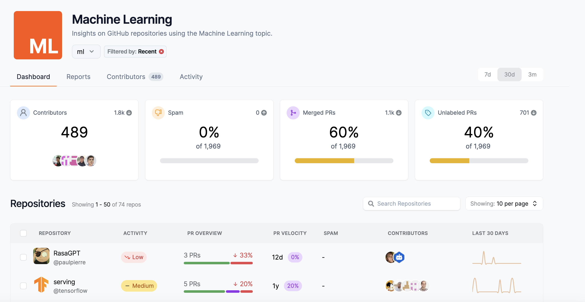
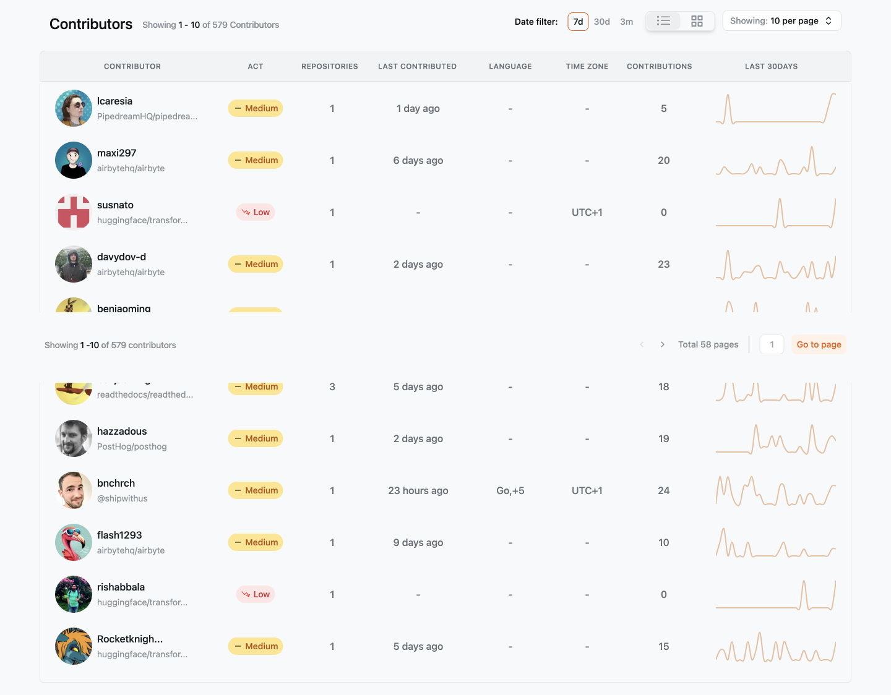

It is important to keep track of your open source contributions and show the impact you have left on the projects and organizations. By organizing your work, you will be able to talk about these meaningful contributions on your resume and in job interviews.

In this guide, we have created a table that you can use to categorize and keep detailed notes for each contribution you have made. We will break down each table component and talk about how to use these in your resume and job profile. You can see a complete example at the end of this guide.

## Personal Information

In this section of the table, you can include information like your name, email, GitHub profile, LinkedIn profile, OpenSauced profile, blog, etc. When it comes to professional profiles, consider which profiles you want to show off to employers that highlight your skills and experience relevant to the types of jobs you are interested in.

| **Section**              | **Details** |
| ------------------------ | ----------- |
| **Personal Information** |             |
| Name                     |             |
| Contact Information      |             |
| LinkedIn                 |             |
| GitHub profile           |             |
| OpenSauced profile       |             |

## Career Goals

If you are new to the industry, you will want to list which area of tech you are interested in pursuing. If you are looking for your next tech role, you can list your current role or the role you wish to switch to.

If you want to level up your role, you should list the key skills required for that next level in this section. You should also link to a few job posts to get an idea of key skills are required for that next level you are working towards.

| **Section**               | **Details**                                  |
| ------------------------- | -------------------------------------------- |
| **Career Goals**          |                                              |
| Desired Job Role          | [Your desired role]                          |
| Desired Job level         | [Junior, Mid, Senior, etc.]                  |
| Key Skills to Develop     | [Skills to focus on]                         |
| Industry/Area of Interest | [Frontend, Backend, Fullstack, ML, AI, etc.] |
| Example Job Links         | [Link to desired jobs]                       |

## Matching Job Requirements to Your Current Skills

A common mistake for many job seekers is to send out the same resume template to all jobs. But in today's tech market, it is important to stand out and tailor your resume to match your skills with the requirements listed.

In the previous section, you identified desired roles and key skills needed for those jobs. When you are reading through job descriptions, you will want to identify key skills that are repeatedly mentioned and add that to your career goals section.

As you fill out the remaining sections for project contributions, check to see if the contributions match the common skills requested in those jobs. If not, then you have just identified a skill gap and will need to find projects and issues that will allow you to strengthen those skills.

## Finding Open Source Projects to Contribute to

After you have filled out the career section of the table, you will want to find open source projects that align with your goals. You can use the explore feature on OpenSauced to explore new repositories in a variety of topics like [JavaScript](https://app.opensauced.pizza/javascript/dashboard/filter/recent?range=30), [Python](https://app.opensauced.pizza/python/dashboard/filter/recent?range=30), and [Machine Learning](https://app.opensauced.pizza/ml/dashboard/filter/recent?range=30).

Finding a good project to contribute to takes time. So, make sure to look at the frequency of contributions to the project and the types of issues and features the project needs help with. If it aligns with your career goals, then start off with smaller issues before moving to larger features. You will also want to join the project's community chat room or Discord channel to connect with other contributors and core team members of the project.

## Open Source Project Contribution

In this next section, you will want to list your meaningful contributions to different open source projects. This can include documentation, code features, bug fixes, etc. Remember that you will want to list out meaningful contributions that match the goals you laid out earlier.

### Basic Project Information

For each project contribution, you will want to list the project name and the PR and issue links. Then, describe in a few short sentences why you chose this project and how it will help you with your career goals.

| **Section**          | **Details**                                    |
| -------------------- | ---------------------------------------------- |
| Project Name         | [Project Name]                                 |
| Project URL          | [Project URL]                                  |
| Why This Project?    | [Reasons for choosing this project]            |
| Type of Contribution | [Code, documentation, community support, etc.] |

### Learn and Development

Once your contribution has been approved and merged into the project, you will want to reflect on what you have learned during this process. What new skills or technologies did you learn while working on this issue? What challenges did you face? How did you interact with the community when you needed clarification on an issue or help with the PR?

Keeping track of this information is helpful because you can reference these experiences later when crafting your resume. Potential employers will want to see how you work with others, solve problems, and deliver solutions in a project.

Feel free to link to the PR and issue discussions as references on how you worked with contributors in this project.

| **Section**                  | **Details**                     |
| ---------------------------- | ------------------------------- |
| **Learning and Development** |                                 |
| New Skills Learned           | [List of new skills]            |
| Challenges Overcome          | [Challenges faced and resolved] |
| Community Interaction        | [Meetups, Discussions, etc.]    |

### Contribution Tracking

For each project contribution, you will want to list the date, a brief summary of the issue, and how you solved it. Also, list any acknowledgments you received from other contributors or core team members on the project because it highlights your impact.

| **Section**                           | **Details**                          |
| ------------------------------------- | ------------------------------------ |
| **Contribution Tracking**             |                                      |
| Date                                  | [Date of contribution]               |
| Contribution Summary                  | [Summary of contribution with links] |
| Feedback Received/Milestones Achieved | [Feedback and achievements]          |

### Using the Highlights Feature to Track Your Contributions

The [Highlights feature](../../features/highlights.md) is where you can display your favorite open source contributions and share your open source story.

You can use this feature to help you track the open source contributions you are most proud of and share your accomplishments with your network. All your highlights will appear on your OpenSauced profile. So, sharing your profile is another way to let potential employers see the types of contributions you've made and the highlights you've identified as the most important.

### Using the Contributor Insight Feature to Follow People

The [Contributor Insights feature](../../features/contributor-insights.md) enables you to categorize, monitor, and analyze different groups of contributors within open source projects.

You can use this feature to create a list of people you interacted with during your open source work. If you continually work with the same individuals, they can act as referrals and references for jobs.

Contributor Insights can also be used to track other people in your network to reach out to about their contributions.

### Using the Repository Insights Feature to Track the Repositories You Contributed to

The [Repository Insights feature](../../features/repo-insights.md) is a comprehensive view of a project's health and individual contributions. You can use it to track the repositories you contributed to or to track repositories of open source companies that are hiring.

### Networking and Professional Development

Some larger features can lead to networking and other professional development opportunities, like speaking at meetups or writing for tech publications. It is important that you list out who you mainly corresponded with for each contribution and any opportunities that came from this contribution.

If you have corresponded with the same core contributors and maintainers over the past few contributions, try reaching out about collaborating on other projects. You never know where an opportunity will lead.

| **Section**                                 | **Details**                        |
| ------------------------------------------- | ---------------------------------- |
| **Networking and Professional Development** |                                    |
| Contacts Made                               | [Contacts made and their roles]    |
| Insights Gained from Networking             | [What you learned from networking] |
| Future Networking Opportunities             | [Planned networking activities]    |

### Using Your OpenSauced Dev Card for Networking

Your [OpenSauced Dev Card](../../features/dev-card.md) serves as your "open source business card" to showcase all of your recent open source activities. You will find recent activity concerning the projects you contribute to, the frequency of PRs, and projects you are interested in.

You can easily share your Dev Card on social media platforms like X/Twitter and LinkedIn to gain attention from potential recruiters and hiring managers.

### Reflection and Next Steps

In this section, you will want to reflect on what went well with this contribution and the areas you struggled with.

Tying these reflections back to your career goals and desired job roles you defined earlier is important. If you are weaker in skills that are required for the jobs you are seeking, use future open source contributions as a way to strengthen these skills.

| **Section**                     | **Details**                                  |
| ------------------------------- | -------------------------------------------- |
| **Reflection and Next Steps**   |                                              |
| Key Takeaways from This Project | [What you learned]                           |
| Areas for Improvement           | [Areas to work on for future projects]       |
| Next Project/Contribution Goal  | [Your next Goal in open source contribution] |

### Using the Highlights Feature to Update Your Professional Profile

After each contribution, you will want to update your LinkedIn profile and resume to highlight your recent achievements. Many recruiters and hiring managers are looking for talented individuals on LinkedIn, so it is important to keep your profile up to date on your recent accomplishments.

The Highlights feature allows you to post about your recent open source contributions on OpenSauced and share them with other social media outlets like Twitter and LinkedIn.

| **Section**                                | **Details**                                |
| ------------------------------------------ | ------------------------------------------ |
| **Resume and Professional Profile Update** |                                            |
| Updates Made to Resume/LinkedIn            | [Details of updates]                       |
| Key Accomplishments Highlighted            | [Key points highlighted]                   |
| Future Plans for Profile Enhancement       | [Plans for further enhancing your profile] |

## Example Chart for Frontend Developer

| **Section**                                               | **Details**                                                                                                                                                            |
| --------------------------------------------------------- | ---------------------------------------------------------------------------------------------------------------------------------------------------------------------- |
| **Personal Information**                                  |                                                                                                                                                                        |
| Name                                                      | Jane Smith                                                                                                                                                             |
| Contact Information                                       | jane.smith@email.com                                                                                                                                                   |
| Professional Profile (LinkedIn/GitHub/OpenSauced profile) | [LinkedIn](https://www.linkedin.com/in/janesmith), [GitHub](https://github.com/janesmith), [OpenSauced](https://app.opensauced.pizza/BekahHW)                          |
| **Career Goals**                                          |                                                                                                                                                                        |
| Desired Job Role                                          | Frontend Developer                                                                                                                                                     |
| Key Skills to Develop                                     | React.js, CSS-in-JS, Web Accessibility                                                                                                                                 |
| Industry/Area of Interest                                 | Web Development, UI/UX Design                                                                                                                                          |
| **Open Source Project Contribution No.1**                 |                                                                                                                                                                        |
| Project Name                                              | Awesome React Components                                                                                                                                               |
| Project URL                                               | [GitHub Repository](https://github.com/awesome-react/components), [OpenSauced Insight Page](https://app.opensauced.pizza/pages/BekahHW/655/dashboard?range=30)         |
| Why This Project?                                         | Interested in learning about creating reusable UI components.                                                                                                          |
| Type of Contribution                                      | Implemented a new responsive carousel component.                                                                                                                       |
| **Learning and Development**                              |                                                                                                                                                                        |
| New Skills Learned                                        | Styled Components, Carousel Design Patterns                                                                                                                            |
| Challenges Overcome                                       | Overcame performance issues with large datasets.                                                                                                                       |
| Community Interaction                                     | Participated in design discussions on the project's Discord channel.                                                                                                   |
| **Contribution Tracking**                                 |                                                                                                                                                                        |
| Date                                                      | 2023-03-10                                                                                                                                                             |
| Contribution Summary                                      | [Pull Request #456](https://github.com/awesome-react/components/pull/456)                                                                                              |
| Feedback Received/Milestones Achieved                     | Positive feedback on the elegant design; milestone: merged into the main branch.                                                                                       |
| **Networking and Professional Development**               |                                                                                                                                                                        |
| Contacts Made                                             | Connected with project maintainers and frontend enthusiasts.                                                                                                           |
| Repository Insights Gained from Networking                | Learned about upcoming trends in frontend development.                                                                                                                 |
| Future Networking Opportunities                           | Planning to attend the project's monthly virtual meetup.                                                                                                               |
| **Reflection and Next Steps**                             |                                                                                                                                                                        |
| Key Takeaways from This Project                           | Improved skills in component design and collaboration.                                                                                                                 |
| Areas for Improvement                                     | Intend to deepen knowledge in state management with Redux.                                                                                                             |
| Next Project/Contribution Goal                            | Contribute to a project focused on enhancing web accessibility.                                                                                                        |
| **Resume and Professional Profile Update**                |                                                                                                                                                                        |
| Updates Made to Resume/LinkedIn                           | Successfully implemented a responsive carousel component, enhancing user experience and receiving positive feedback. Demonstrated expertise in React.js and CSS-in-JS. |
| Key Accomplishments Highlighted                           | Highlighted successful implementation of the responsive carousel.                                                                                                      |
| Future Plans for Profile Enhancement                      | Attend frontend development conferences and workshops.                                                                                                                 |

## Additional Resources

If you're looking for more resources about the job hunt, check out these OpenSauced posts:

- [Building Your DevRel Resume with Open Source](https://dev.to/opensauced/building-your-devrel-resume-with-open-source-4km3)
- [How to Talk About Your Open Source Experience in a Tech Interview](https://dev.to/opensauced/how-to-talk-about-your-open-source-experience-in-a-tech-interview-3l96)
