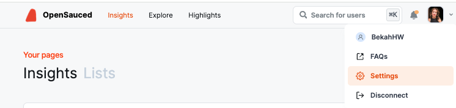
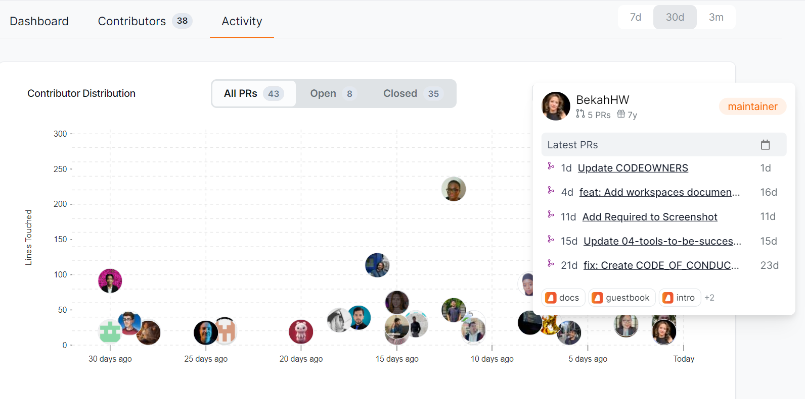

## Introduction to OpenSauced for Students

Welcome to the wonderful world of open source. As a student, you'll find countless opportunities to contribute to projects, collaborate across global projects, and enhance your resume through meaningful contributions. You can use OpenSauced as a tool to enhance your open source journey by helping you to find interesting repositories that match your academic and personal interests, document your journey, learn from the community, and showcase your growth.

In this guide, you will learn how to use OpenSauced features like your personal [Dev Card](../../features/dev-card.md), [Highlights](../../features/highlights.md), [Contributor Insights](../../features/contributor-insights.md), and [Repository Insights](../../features/repo-insights.md) to showcase your open source work and build connections to help you meet your next goals.

## Getting Started

To get started, you will need to create an account on OpenSauced. You can do this by visiting [app.opensauced.pizza](https://app.opensauced.pizza) and clicking the "Connect with GitHub" button. You will be prompted to sign in with your GitHub account. Once you have signed in, you will be redirected to the OpenSauced dashboard. The best place to get started is by creating your profile.

## Creating Your Profile

Creating your profile is a great way to showcase your open source contributions, connect with other contributors and maintainers, and share with your classmates, communities, and connections. Here are some steps to help you get started:

1. After creating your account, navigate to "Settings."

   

2. Once there, you will be asked to add your name, bio, links to your social media accounts, timezone, and other forms of contact information.

   :::tip

   Don't forget to add your personal site, GitHub Sponsors URL, and LinkedIn so people can connect with you and learn more about your work.

   :::

3. In the "Interests" section, select the various programming languages and topics you are interested in. Setting them up helps us recommend open source projects that fit your interests.
4. Manage your email preferences.

### Your Profile

Your profile is a great resource for showcasing your contributions and sharing your open source work with others.

On your profile, you will see the "Highlights" tab, which you can learn more about [in this section](#highlights-connecting-and-recognizing-contributions). Other tabs you may find useful on your profile are: 

- **Contributions**: This tab includes a graph showing the number of PRs you have opened, [the velocity of your PRs](../../welcome/glossary.md#pr-velocity), and the number of repositories you have contributed to in the last thirty days. Underneath the graph is a "Latest PRs" chart, which shows a list of current and recent PRs. This tab is helpful if you want to showcase a steady and consistent open source contribution experience.
- **Recommendations**: This tab includes a list of open source projects that are chosen based on the programming languages you picked in the "Interests" section of your public profile. It is useful if you're looking for new projects to contribute to.

:::tip

To get the full benefit of your profile, share it on social media, include a link to it on your resume, LinkedIn, your GitHub Readme, and your personal website to showcase your most up-to-date open source contributions.

:::

### Your Dev Card

Another fun way to share your open source contributions is through your [Dev Card](../../features/dev-card.md). Your Dev Card is a visual representation of your open source contributions. It includes your profile picture, name, bio, and the number of your latest contributions. 

## Explore: Finding Your Next Open Source Project

The "Explore" tab is a great place to start if you're looking for a new open source project to contribute to. Here, you can find a list of open source projects and filter them by language, top repos, recent, most active, and more.

Once you've selected your filters, you'll be able to see the contributors, spam, and activity levels of the repository. Understanding a repository's activity level and PR velocity can help you determine if it's a good fit for you to contribute to and what to expect when you submit a PR.

For example, if you wanted to look for a JavaScript project to contribute to, you would select "JavaScript" from the language dropdown and "Most Active" from the filter dropdown to see the most active JavaScript projects on GitHub. If you want to keep track of the repositories you're interested in contributing to, you can select and add them to a [Repository Insights Page](../../features/repo-insights.md) or your [Workspace](../../features/workspaces.md).

## Highlights: Connecting and Recognizing Contributions

Leveraging OpenSauced's [Highlights](../../features/highlights.md) feature is a great way to showcase your valuable contributions to open source projects. You can curate and share your achievements and milestones, bringing visibility to your hard work.

The Highlights feature allows you to:

- talk about issues that you raised,
- share blog posts that you've written,
- display Pull Requests that showcase your contributions.

### Creating a New Highlight

There are two ways to create a new highlight:

1. Paste the URL to your PR, issue, or blog post (shown in blue below).
2. Choose from a list of suggestions (shown in orange below).

:::note

If you're adding a blog post, you'll need to associate it to a repository by clicking the "Add a repo" button.

:::

Finally, it's time to add the details of your highlight. You can write the description yourself or use the auto-summarize button to generate one.

### Writing an Effective Highlight

Sharing the story of your hard work is an opportunity to connect with the reader, which could include potential collaborators, other contributors, maintainers, or anyone on OpenSauced. Here are some tips to help you write effective stories for your highlights:

#### Highlighting Issues

1. **Share your motivation**: Briefly explain why you raised the issue. For example, "I'm passionate about improving accessibility because I believe everyone should have equal access to information."
2. **Summarize the issue**: Briefly describe the issue you wrote so your readers have context. For example, "I raised an issue to add alt text to images in the project's 'About Us' page."
3. **Describe the impact:** Briefly state how the resolution of the issue will improve the project. For example, "This will help people who use screen readers understand the content better."

#### Highlighting PRs

1. **Describe the PR**: Start with a clear summary of what your PR accomplishes. For example, "I added a new feature to the project's Chrome Extension that allows users to summarize content."
2. **Highlight your solution and its impact**: Briefly describe the solution, any challenges you faced, or any part of the PR you're particularly proud of. For example, "Initially, I faced challenges with the API, but I was able to resolve them using a different endpoint."
3. **Reflect on your experience**: Mention what you learned from working on the PR. For example, "I learned a lot about the Chrome Extension API and how to use it to create new features."

#### Highlighting Blog Posts

1. **Describe the topic**: Begin with an interesting blog post summary to help others understand your writing.
2. **Discuss the inspiration**: Explain why you wrote this blog post. Is it to guide others on improving their coding skills, raise awareness about an issue in the tech community, or display your progress in learning a new programming language?
3. **End with a call-to-action**: Encourage others to read and engage with the post.

## Creating Your Workspace

As a student working on multiple projects or contributing to various open source repositories, keeping track of progress, goals, and collaboration can be daunting. To keep track of the repositories that are most important to you or repositories that you're working on with a team, OpenSauced Workspaces can be your go-to tool for organizing and understanding your open source journey.

Your Workspace helps you to:

- **Understand projects at a high level**: Being able to look at all the repositories that are important to you and understand them at a high level makes it easier for you to share this information and collaborate with others.
- **Enhance team collaboration**: If you're working with a group, you can keep track of what everyone is working on. This transparency is key to teamwork and support, whether you're setting goals for a class project, contributing to a group assignment, or working together for accountability.
- **Deepen your project insight**: Understanding the underlying activities of the projects you're tracking helps you to understand their progress, health, and the community of student contributors you're part of.
- **Celebrate and communicate your achievements**: When it's time to talk about your experience, having analytics on the projects you worked on allows you to showcase your contributions, acknowledge the efforts of your peers, and clearly communicate the hard work invested.

Workspaces offer a centralized platform. It's perfect for students to organize, track, and analyze the open source projects they're working on.

### Creating a New Workspace

To create a workspace, start by accessing the **Workspace switcher** in the sidebar. From there, you can create a new workspace or view an existing one.

 

:::note

Whenever you select "Home", you'll be taken to the last workspace you opened.

:::

### Adding Repositories to Your Workspace

If you're creating a new workspace, you'll have the option to add repositories at the time of creation.

Start by creating a workspace name, then click "Add repositories". You'll have three options for adding repositories:

1. **Search for Repositories**: Use our search tool by adding an organization name, followed by the repository name, and add them to your workspace.
2. **Import a GitHub Organization**: Connect to your GitHub organizations to create a workspace from an organization. (If you're having trouble with this, see the "[Sync Your GitHub Team](../../welcome/faqs.md#sync-your-github-team)" section in our FAQs.)
3. **Import Repositories**: Paste a list of repositories to add to your workspace.

Once your repositories are added, you'll be able to see them in your repository dashboard. You can also edit your workspace to add or remove repositories anytime.

### Navigating Your Workspace

Once your repositories are connected, you'll enter your Workspace dashboard. In your workspace dashboards, you can create, view, and manage your workspaces.

#### Repositories Dashboard

Within the repositories dashboard, you can view the following metrics, which are over a period of thirty days by default:

- **Pull Requests**: This includes the total number of opened and merged pull requests for the repositories in your workspace and the velocity of pull requests being merged.
- **Issues**: This includes the total number of opened and closed issues for the repositories in your workspace and the velocity of issues being closed.
- **Engagement**: This includes the total number of stars, forks, and activity ratio for the repositories in your workspace.

### Why Create a Workspace?

There are many reasons to create a workspace. Here are a few:

1. **Targeted Contributions**: Workspaces allow you to create a list of repositories you are interested in or actively contributing to, which can help you stay focused on projects that align with your interests or goals.

2. **Job Search Organization**: You can create workspaces dedicated to tracking open source projects from companies known for hiring contributors, which can help you find potential job opportunities.

3. **Coursework Management**: For managing group open source projects or individual assignments, a workspace can be used to organize repositories that are part of the assignments, keeping all relevant repositories in one accessible location.

4. **Skill-Specific Exploration**: You can use workspaces to follow repositories that help you build specific skills or understand certain technologies, creating a tailored learning environment that aligns with your career path or focus.

5. **Community Engagement Tracking**: By adding repositories you're interested in, you can monitor and engage with the communities behind them. This allows you to understand the dynamics of open source collaboration, which is invaluable for both personal and professional networking.

## Repository Insights: Connecting Your Repositories

OpenSauced [Repository Insights](../../features/repo-insights.md) allows you to track open source projects you are interested in. You can use Repository Insights Pages to track repositories' growth, analyze work, and connect with others.

### Why Create a Repository Insights Page?

- **To track projects you're working on**: Tracking projects you're working on can help you stay up-to-date with the latest activity and trends and connect with other contributors.
- **To identify potential projects to contribute to**: If you're looking for a new project to contribute to, you can use the Repository Insights feature to track active projects that are looking for contributors. You can use the "Explore" tab to find new projects to contribute to and track them with your Repository Insights page.
- **To network and engage with the community**: Finding people to work and connect with can be challenging. You can connect with your network through the feature's "Contributors" tab.
- **To track the activity of a topic you're interested in**: Keeping up with the latest trends and activity in a particular topic can be challenging. You can use the Repository Insights feature to track the activity of a specific topic and find new projects to contribute to. For example, you can create a [Repository Insight Page for Active AI Repositories](https://app.opensauced.pizza/pages/BekahHW/1055/dashboard).
- **To track the activity of your favorite programming languages**: If you're interested in tracking the activity of your favorite programming languages, you can use the Repository Insights feature to track the open source projects that are using them.
- **To aid in the job search**: If you're looking for a job, you can use the Repository Insights feature to track the activity of the organizations you're interested in working on. This can help you understand the activity level of the repositories and the types of contributions being made, and even identify which company you want to contribute to.
- **Curating collections for interest groups**: You can curate and share repositories focusing on sectors and programming languages that interest you.

Within your workspace, you can create new lists of repositories called Repository Insight Pages.

### Creating a New Repository Insight Page

To track the repositories, click the "+" next to "Insights" in the sidebar, then select "New Repository Insight." You will be redirected to a page where you can create your new Repository Insight Page.

There are two ways to add repositories to your Repository Insight Page:

1. **Sync GitHub organization**: Syncing your GitHub organizations is a good idea if you want to keep track of their open source project activities and trends.
2. **Connect individual repositories**: Connecting individual repositories is a good idea if you want to keep track of the contributions of a specific repository or group of repositories.

### Using Your Repository Insights Page

Once you have connected your repositories, you will be redirected to your Repository Insight Page. Here, you will see a dashboard with an overview of the repositories and the contributors who have contributed to them.

There are three tabs that provide you with more information on these repositories:

#### Repositories Dashboard

If you're looking for an active project to contribute to, this tab can help you. It contains information such as activity levels, PR overview, PR velocity, spam PRs, contributors, and activity stats over the last 30 days. This information is also a good way to connect with others on the project or where to find support.

#### Contributors

The "Contributors" tab allows you to view more detailed information about other contributors, including activity levels, the number of repositories they contributed to, the date of their last contribution, their most used language, their time zone, the number of contributions, and their activity stats over the last 30 days. This can be a great way to find others to collaborate with or to reach out to for support.

:::tip

Want to learn more about your peers? You can select and add them to a Contributor Insight Page.

:::

#### Activity

The "Activity" tab shows a graph of the last time each contributor created their PR and how many lines of code they've touched. It also provides more detailed information on each contributor when you hover over their image, including their latest PRs and repositories they've contributed to. Clicking their image will bring you to their profile on OpenSauced.

Beyond understanding repositories, you may want to get insights into other contributors to help you learn more about how others are contributing to open source. One way to do that is through Contributor Insights.

## Contributor Insights: Connecting with Contributors

The [Contributor Insights](../../features/contributor-insights.md) feature helps you connect with other contributors or learn more about what others are up to in open source. With this feature, you can categorize, watch, and check out different groups of contributors within open source projects.

### What Can You Do with Contributor Insights?

There are many things you can do with this feature, but here are some ideas to get you started:

- **Track personal contributions**: If you create a list of your personal contributions, you can track them and see how you're doing over time, as well as get a breakdown of the type of contributions you're making, including commits, created PRs, reviewed PRs, and created issues.
- **Learn about what other contributors are doing in open source**: You can learn where other contributors are contributing, what they're working on, and how active they are in the open source community.
- **See who's using the OpenSauced Highlights feature**: You can see who's using the Highlights feature and show them support by giving an emoji reaction.
- **Track contributors for job opportunities**: If you're looking for a job, you can track the activity of the contributors you're interested in working with. This helps you understand the activity level of the repositories and the types of contributions being made, and you can even identify which company you want to contribute to.
- **Track your classmates or peers**: If you're working with a group, you can track the activity of your classmates or peers to see what they're working on and how active they are in the open source community.

### Creating a New Contributor Insights Page

1. Click the "+" next to "Insights" in your sidebar.
2. Select "New Contributor Insight" to start a new Contributor Insight Page.
3. Give your page a name.
4. Add contributors to your page by searching for their GitHub username, syncing your GitHub Team, or importing your GitHub Following.
5. Once your page is created, you can edit and choose to make it public or private. By default, it is set to public. To create a private page, you can upgrade your account to a paid plan.

## Using Your Contributor Insights Page

Once you have created your list, you will be redirected to your Contributor Insights Page. Here, you will see a dashboard with an overview of the contributors.

There are three tabs that provide you with more information on these repositories:

### Overview

The "Overview" tab gives you a high-level view of the contributors in your list, including the total number of commits in the last 30 days and the types of contributors: Active, New, and Alumni.

### Activity

The "Activity" tab gives you a graph view with more detailed information on each contributor, including the type of activity, repositories they've contributed to, and how they compare to each other.

You can filter your Contributor Insight Page by All Contributors, Active Contributors, New Contributors, and Alumni Contributors.

### Highlights

The "Highlights" tab gives you a list of the highlights that the contributors listed on your page have created. This is a great way to see what other contributors are up to and to show them support.

## Takeaways

- **Create Your Profile**: Creating your profile is a great way to display your open source contributions, connect with other contributors and maintainers, and share during a job search.
- **Explore**: The "Explore" tab is a great place to find new open source projects to contribute to.
- **Highlights**: Leveraging OpenSauced's Highlights feature is a great way for you to showcase your valuable contributions to open source projects.
- **Repository Insights**: OpenSauced Repository Insights feature allows you to track open source projects you are interested in.
- **Contributor Insights**: The Contributor Insights feature helps you understand other contributors or track your own work in open source.

## Conclusion

Embarking on your open source journey with OpenSauced opens up a world of learning and development opportunities. It's a chance to apply your knowledge to real-world projects, collaborate with a global community, and build a portfolio that stands out to educators and employers alike. We're excited to support you on this journey and can't wait to see the contributions you'll make and the milestones you'll achieve. If you have any questions or need assistance, our community is here to help you navigate your path in open source.

Here are some other resources you might find helpful in your journey:

- [100 Days of OSS](../../community/100-days-of-oss.md)
- [Intro to Open Source Course](https://intro.opensauced.pizza/#/)
- [Resume Driven Contributions](https://opensauced.pizza/blog/resume-driven-contributions)
- [Stop Burning Out Maintainers: An Empathetic Guide for Contributors](https://opensauced.pizza/blog/stop-burning-out-maintainers-an-empathetic-guide-for-contributors)
- [GitHub Student Benefits](https://gh.io/AApppma)
- [GitHub Student Developer Pack](https://gh.io/AApphwi)
