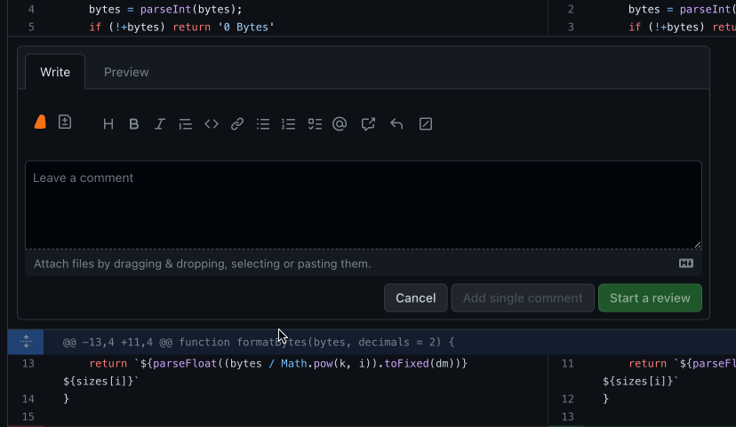

Generate an explanation for a block of code using the blue plus button that is displayed when hovering over a line. To select a block of code, hover over the starting line, click, and drag the blue plus button until you reach the desired line.

